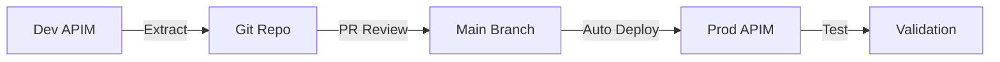

# NIAID Azure API Management DevOps Repository

## Overview

This repository implements **GitOps for Azure API Management (APIM)** using Microsoft's [Azure APIops Toolkit](https://github.com/Azure/apiops). It automates the extraction, version control, and deployment of API Management artifacts across development and production environments.

### Key Features

- ✅ **Automated API Extraction** from development APIM to Git
- ✅ **Automated Deployment** to production APIM via pull request merges
- ✅ **Version Control** for all APIM artifacts (APIs, policies, backends, products, etc.)
- ✅ **Environment-Specific Configuration** with templating support
- ✅ **Automated API Testing** using ephemeral Azure VMs for internal VNet testing
- ✅ **API Linting** with Spectral for OpenAPI specification quality
- ✅ **Internal VNet Support** for secure, private APIM instances

---

## Repository Structure

```
API-DEVOPS/
├── .github/
│   └── workflows/                           # GitHub Actions workflows
│       ├── run-extractor.yaml              # Extract artifacts from DEV APIM
│       ├── run-publisher.yaml              # Deploy artifacts to PROD APIM
│       ├── run-publisher-with-env.yaml     # Reusable deployment workflow
│       ├── test-apis.yaml                  # API testing (standard)
│       └── test-apis-ephemeral.yaml        # API testing (ephemeral VM approach)
│
├── apimartifacts/                          # Source of truth for APIM configuration
│   ├── policy.xml                          # Global APIM policies (CORS, etc.)
│   ├── apis/                               # API definitions
│   │   ├── crms-api-qa/
│   │   ├── demo-conference-api/
│   │   ├── echo-api/
│   │   ├── itpms-chat-api/
│   │   ├── merlin-db/
│   │   ├── opentext/
│   │   ├── otcs-mcp-server/
│   │   └── test/
│   │       ├── apiInformation.json         # API metadata (path, protocols, etc.)
│   │       ├── specification.yaml          # OpenAPI specification
│   │       ├── policy.xml                  # API-level policies (optional)
│   │       └── operations/                 # Operation-level policies (optional)
│   ├── backends/                           # Backend service definitions
│   │   ├── niaid-azure-oaipoc-api-fa/
│   │   ├── opentext-mcp-sop-policies-backend-*/
│   │   └── WebApp_nih-niaid-bpimb-mcp-opentext-wa/
│   ├── diagnostics/                        # Logging and monitoring config
│   │   ├── applicationinsights/
│   │   └── azuremonitor/
│   ├── gateways/                           # Self-hosted gateway configs
│   │   ├── NIAID_CRMS_Test/
│   │   └── test-echo/
│   ├── groups/                             # User groups
│   ├── loggers/                            # Logger configurations
│   ├── named values/                       # Configuration values and secrets
│   ├── products/                           # API product bundles
│   │   ├── merlinws/
│   │   ├── starter/
│   │   └── unlimited/
│   ├── subscriptions/                      # API subscription keys
│   └── tags/                               # Organizational tags
│
├── dev-extracted/                          # Historical extractions (reference only)
│   └── artifacts-from-portal/
│
├── configuration.extractor.yaml            # Extraction configuration
├── configuration.production.yaml           # Production deployment configuration
└── README.md                               # This file
```

### Artifact Structure Details

Each API in `apimartifacts/apis/` contains:

- **`apiInformation.json`**: Core API metadata
  - Display name, path, protocols
  - Service URL (backend)
  - Subscription settings
  - Authentication configuration

- **`specification.yaml`**: OpenAPI 3.0 specification
  - Endpoints, parameters, schemas
  - Request/response definitions
  - Validated by Spectral linting

- **`policy.xml`**: API-level policies (optional)
  - Authentication, rate limiting
  - Request/response transformation
  - Custom business logic

- **`operations/`**: Operation-specific policies (optional)
  - Individual endpoint overrides
  - Per-operation transformation

---

## Infrastructure Components

### Azure Resources

#### DAIDS_DEV Environment (Extractor Source)
- **APIM Service**: `apim-daids-connect`
  - Resource Group: `nih-niaid-avidpoc-dev-rg`
  - Region: `eastus`
  - SKU: `Developer`
  - Network: Internal VNet (`nih-niaid-azurestrides-dev-apim-az`)
  - Gateway: `apim-daids-connect.azure-api.net` (Private IP: `10.178.57.52`)
  - Purpose: Source for artifact extraction

- **Application Insights**: `apim-daids-connect-ai`
  - Resource Group: `nih-niaid-avidpoc-dev-rg`
  - Region: `eastus`
  - Instrumentation Key: `98066d90-6565-4993-b071-c5a453f2ce44`
  - Purpose: APIM diagnostics and logging

#### DEV Environment (Deployment Target)
- **APIM Service**: `niaid-bpimb-apim-dev`
  - Resource Group: `niaid-bpimb-apim-dev-rg`
  - Region: `eastus2`
  - SKU: `Developer`
  - Network: Internal VNet (`nih-niaid-azurestrides-bpimb-dev-apim-az`)
  - Gateway: `niaid-bpimb-apim-dev.azure-api.net` (Private IP: `10.179.0.4`)
  - Purpose: Target for automated deployments

- **Application Insights**: `niaid-bpimb-apim-dev-ai`
  - Resource Group: `niaid-bpimb-apim-dev-rg`
  - Region: `eastus2`
  - Instrumentation Key: `369236ca-f1b0-43f7-a58e-036094365a7c`
  - Purpose: APIM diagnostics and logging

#### QA Environment
- **APIM Service**: `niaid-bpimb-apim-qa`
  - Resource Group: `niaid-bpimb-apim-qa-rg`
  - Region: `eastus2`
  - SKU: `Developer`
  - Network: Internal VNet (`nih-niaid-azurestrides-bpimb-qa-apim-az`)
  - Gateway: `niaid-bpimb-apim-qa.azure-api.net` (Private IP: `10.180.0.4`)
  - Purpose: QA/Testing environment
  - **Status**: ✅ Configured and ready for deployment

- **Application Insights**: `niaid-bpimb-apim-qa-ai`
  - Resource Group: `niaid-bpimb-apim-qa-rg`
  - Region: `eastus2`
  - Instrumentation Key: `6540b7ee-bd2a-4529-9242-d8ca2749a6cd`
  - Purpose: APIM diagnostics and logging

- **Service Principal**: `github-apidevops-qa`
  - App ID: `7a03a242-6e15-4a00-84a7-a772988a5b71`
  - Purpose: Dedicated QA environment access
  - Created: December 26, 2025

#### Network Configuration

**DAIDS_DEV VNet** (`nih-niaid-azurestrides-dev-apim-az`):
- Address Space: `10.178.57.0/24`
- APIM Subnet: `niaid-apim` (`10.178.57.48/28`)
- Test VM Subnet: `niaid-commonservices-test` (`10.178.57.64/27`)

**DEV VNet** (`nih-niaid-azurestrides-bpimb-dev-apim-az`):
- Address Space: `10.179.0.0/24`
- APIM Subnet: `dev-apim-subnet` (`10.179.0.0/28`)
- Test VM Subnet: `dev-commonservices` (`10.179.0.32/27`)

**QA VNet** (`nih-niaid-azurestrides-bpimb-qa-apim-az`):
- Address Space: `10.180.0.0/24`
- APIM Subnet: `qa-apim-subnet` (`10.180.0.0/28`)
- Test VM Subnet: `qa-commonservices` (`10.180.0.32/27`)
- **Status**: ✅ Complete - VNet configured and APIM migrated

### API Inventory

Currently managing **7 APIs**:

| API Name | Purpose | Path |
|----------|---------|------|
| `crms-api-qa` | Clinical Research Management System (QA) | `/crms-api-qa` |
| `demo-conference-api` | Demo API for conference showcase | `/conference` |
| `echo-api` | Testing/debugging echo service | `/echo` |
| `merlin-db` | Merlin database API | `/merlin-db` |
| `opentext` | OpenText document management | `/opentext` |
| `otcs-mcp-server` | OpenText Content Server MCP | `/otcs-mcp` |
| `test` | General testing API | `/test` |

> **Note**: `itpms-chat-api` was removed on December 26, 2025 as part of POC cleanup. See [POC-EXPORT-niaid-azure-oaipoc-api-fa.md](POC-EXPORT-niaid-azure-oaipoc-api-fa.md) for archived configuration.

---

## GitHub Actions Workflows

### 1. Extract Artifacts (`run-extractor.yaml`)

**Purpose**: Extract APIM artifacts from DAIDS_DEV environment to Git repository

**Trigger**: Manual workflow dispatch

**Pipeline Flow**:
```
DAIDS_DEV APIM (apim-daids-connect) → Extractor Tool → apimartifacts/ folder → Git commit
```

**Configuration Options**:
- **Extract All APIs**: Extracts all artifacts from DAIDS_DEV APIM
- **Use configuration.extractor.yaml**: Selectively extract specific APIs/artifacts

**Environment Variables**:
- Uses `daids_dev` environment secrets
- `AZURE_CLIENT_ID`, `AZURE_CLIENT_SECRET`, `AZURE_TENANT_ID`
- `AZURE_SUBSCRIPTION_ID`, `AZURE_RESOURCE_GROUP_NAME`
- `API_MANAGEMENT_SERVICE_NAME`

**Tool Version**: Azure APIops `v6.0.2`

**Usage**:
```bash
# Extract all APIs
gh workflow run run-extractor.yaml -f CONFIGURATION_YAML_PATH="Extract All APIs"

# Extract specific APIs defined in configuration
gh workflow run run-extractor.yaml -f CONFIGURATION_YAML_PATH="configuration.extractor.yaml"
```

---

### 2. Publish to DEV (`run-publisher.yaml`)

**Purpose**: Deploy artifacts from repository to DEV APIM

**Trigger**: 
- Push to `main` branch (automatic)
- Manual workflow dispatch

**Pipeline Flow**:
```
Git Repository (apimartifacts/) → Publisher Tool → DEV APIM (niaid-bpimb-apim-dev) → Automated Tests
```

**Deployment Modes**:

1. **Incremental Deployment** (default on push to main):
   - Only deploys changed artifacts from last commit
   - Uses Git commit ID to identify changes
   - Faster, lower risk

2. **Full Deployment** (manual option):
   - Redeploys all artifacts in repository
   - Used for disaster recovery or after build failures
   - Select "publish-all-artifacts-in-repo" option

**Features**:
- ✅ **API Specification Linting**: Validates OpenAPI specs with Spectral
- ✅ **Secret Substitution**: Replaces tokens in configuration files
- ✅ **Post-Deployment Testing**: Triggers full API test suite on PROD
- ✅ **Logging**: Configurable log levels (Information, Debug, etc.)

**Usage**:
```bash
# Automatic on push to main (incremental)
git push origin main

# Manual full redeployment
gh workflow run run-publisher.yaml -f COMMIT_ID_CHOICE="publish-all-artifacts-in-repo"

# Manual incremental deployment
gh workflow run run-publisher.yaml -f COMMIT_ID_CHOICE="publish-artifacts-in-last-commit"
```

---

### 3. Reusable Publisher (`run-publisher-with-env.yaml`)

**Purpose**: Reusable workflow for environment-specific deployments

**Called By**: `run-publisher.yaml`

**Inputs**:
- `API_MANAGEMENT_ENVIRONMENT`: Target environment (dev/prod)
- `CONFIGURATION_YAML_PATH`: Configuration file path
- `COMMIT_ID`: Git commit for incremental deployment (optional)
- `API_MANAGEMENT_SERVICE_OUTPUT_FOLDER_PATH`: Artifacts folder

**Steps**:
1. Checkout repository
2. Run Spectral linting on OpenAPI specs
3. Perform secret substitution in configuration files
4. Download Azure APIops publisher tool
5. Execute publisher with appropriate parameters

---

### 4. API Testing (`test-apis.yaml`)

**Purpose**: Standard API testing workflow

**Trigger**: Manual workflow dispatch

**Runner Types**:
- **Production**: GitHub-hosted runners (`ubuntu-latest`)
- **Development**: Self-hosted runners (internal network access)

**Test Types**:

1. **Health Check**: 
   - Validates APIM gateway responds
   - Accepts HTTP 404, 401, 403 as healthy

2. **Endpoint Availability**:
   - Tests all API endpoints
   - Accepts HTTP 200, 401, 403, 404

3. **Full Suite**:
   - Runs all test types

**Usage**:
```bash
# Test prod environment health
gh workflow run test-apis.yaml -f ENVIRONMENT=prod -f TEST_TYPE=health-check

# Test specific API
gh workflow run test-apis.yaml -f ENVIRONMENT=prod -f API_NAME=echo-api -f TEST_TYPE=endpoint-availability

# Run full test suite
gh workflow run test-apis.yaml -f ENVIRONMENT=prod -f TEST_TYPE=full-suite
```

---

### 5. Ephemeral VM Testing (`test-apis-ephemeral.yaml`)

**Purpose**: Test internal APIM instances using temporary Azure VMs

**Why Needed**: 
- APIM instances are in internal VNets (not publicly accessible)
- No persistent self-hosted runners required
- Tests from within Azure network boundary

**How It Works**:

```
1. CREATE → Provision Ubuntu VM in APIM VNet (Standard_B1s)
2. TEST   → Run tests via az vm run-command with private IP
3. CLEANUP → Delete VM automatically (success or failure)
```

**Features**:
- ✅ No persistent infrastructure costs
- ✅ Automatic cleanup (even on failure)
- ✅ Network diagnostics included
- ✅ Tests using private IPs within VNet

**Workflow Steps**:

1. **Create Test VM**:
   - VM Name: `test-runner-<timestamp>`
   - Image: Ubuntu2204
   - Size: Standard_B1s (minimal cost)
   - Network: Same VNet as APIM, no public IP
   - Location: Same subnet as commonservices

2. **Run Tests**:
   - Detect APIM private IP using `az vm run-command`
   - Execute PowerShell test scripts on VM
   - Test gateway health or API endpoints

3. **Cleanup**:
   - Always runs (`if: always()`)
   - Deletes VM and all associated resources
   - Total VM lifetime: ~5-10 minutes

**Usage**:
```bash
# Test dev environment
gh workflow run test-apis-ephemeral.yaml -f ENVIRONMENT=dev -f TEST_TYPE=health-check

# Test specific API in prod
gh workflow run test-apis-ephemeral.yaml -f ENVIRONMENT=prod -f API_NAME=opentext -f TEST_TYPE=endpoint-availability

# Full suite on prod
gh workflow run test-apis-ephemeral.yaml -f ENVIRONMENT=prod -f TEST_TYPE=full-suite
```

**Cost**: ~$0.01-0.02 per test run (5-10 minutes of B1s VM time)

---

### 6. Azure Advisor Compliance Check (`check-advisor.yaml`)

**Purpose**: Monitor Azure Advisor recommendations for continuous compliance tracking

**Trigger**: 
- Weekly schedule (Mondays at 9 AM UTC)
- Manual workflow dispatch

**Features**:
- ✅ Tracks security, cost, performance, and reliability recommendations
- ✅ Counts recommendations by priority (High/Medium/Low)
- ✅ Generates markdown compliance report
- ✅ Saves recommendations as downloadable artifacts
- ✅ Provides GitHub Actions annotations for high priority findings
- ✅ Does not fail workflow (informational only)

**Usage**:
```bash
# Run compliance check for prod environment
gh workflow run check-advisor.yaml -f ENVIRONMENT=prod

# Run for dev environment
gh workflow run check-advisor.yaml -f ENVIRONMENT=dev

# View latest report
gh run list --workflow=check-advisor.yaml --limit 1
gh run view <run-id>
gh run download <run-id>  # Download the compliance report
```

**Report Contents**:
- Summary by priority level (High/Medium/Low)
- Summary by category (Security/Cost/Performance/Reliability)
- Detailed list of all recommendations grouped by priority
- Resource names affected by each recommendation

**Integration with Publisher**:
- Optional post-deployment compliance check (currently commented out)
- Uncomment in `run-publisher.yaml` to enable automatic checks after deployments

**Notifications**:

The workflow uses GitHub's built-in notification system for reporting:

- ✅ **Workflow Success/Failure**: GitHub sends email notifications based on your [notification settings](https://github.com/settings/notifications)
- ⚠️ **High Priority Findings**: Warnings are displayed in the Actions workflow run UI
- 📊 **Compliance Reports**: Always uploaded as downloadable artifacts with 90-day retention
- 📈 **Summary Stats**: Displayed in workflow run output (total count, priority breakdown, categories)

**How to Receive Notifications**:
1. Configure your GitHub notification preferences at Settings → Notifications
2. Enable "Actions" notifications (email, web, or mobile)
3. You'll receive emails automatically on workflow failures or completion
4. Download detailed reports from workflow artifacts

**Viewing Reports**:
- Navigate to Actions → Check Azure Advisor Compliance → Latest run
- Click "advisor-compliance-report-prod" artifact
- Download and view the markdown report

**Troubleshooting**:

If the workflow returns 0 recommendations but you see recommendations in the Azure Portal:

1. **Check Service Principal Permissions**: The service principal needs **Reader** role on the resource group or subscription
   ```bash
   # Grant Reader role to service principal
   az role assignment create \
     --assignee <service-principal-app-id> \
     --role "Reader" \
     --scope "/subscriptions/<subscription-id>/resourceGroups/niaid-bpimb-apim-dev-rg"
   ```

2. **Verify Environment Secrets**: Ensure the `prod` environment in GitHub has correct secrets configured

3. **Check Azure Advisor Cache**: Recommendations may take 24-72 hours to appear after infrastructure changes

---

## Configuration Files

### `configuration.extractor.yaml`

Controls what gets extracted from DEV APIM.

```yaml
apimServiceName: apim-daids-connect  # DEV APIM instance

apis:
  - name: crms-api-qa
  - name: demo-conference-api
  - name: echo-api
  # ... additional APIs

# Optional sections (commented out by default):
# namedValues:
# products:
# backends:
```

**Usage**:
- Extract only specific APIs (reduces extraction time)
- Version control which artifacts are managed
- Exclude legacy or manually-managed resources

---

### `configuration.production.yaml`

Controls deployment to PRODUCTION APIM.

```yaml
apimServiceName: niaid-bpimb-apim-dev  # PROD APIM instance

# API-specific configuration overrides
apis:
  # Example:
  # - name: demo-conference-api
  #   diagnostics:
  #     - name: applicationinsights
  #       properties:
  #         verbosity: Error
```

**Features**:
- Environment-specific overrides
- Diagnostic configuration
- Secret token replacement using `{#TOKEN_NAME#}` syntax

**Important Notes**:
- ⚠️ **SOAP/WSDL APIs NOT SUPPORTED** by Azure APIops v6.0.2
- SOAP APIs must be managed manually via Azure Portal
- APIops will ignore manually-deployed SOAP APIs

---

## Development Workflow

### Standard GitOps Pipeline



### Step-by-Step Process

#### 1. Make Changes in DEV APIM
- Use Azure Portal to develop/test APIs in DEV environment
- Configure policies, backends, products, etc.

#### 2. Extract Artifacts
```bash
# Extract changes from DEV to Git
gh workflow run run-extractor.yaml -f CONFIGURATION_YAML_PATH="configuration.extractor.yaml"

# Wait for workflow to complete
gh run watch

# Pull extracted changes
git pull origin main
```

#### 3. Create Feature Branch
```bash
# Create feature branch
git checkout -b feature/add-new-api

# Review extracted changes
git status
git diff

# Commit to feature branch
git add .
git commit -m "Add new API from DEV environment"
git push origin feature/add-new-api
```

#### 4. Create Pull Request
```bash
# Create PR
gh pr create --title "Add new API" --body "Extracted new API from DEV APIM"

# Request reviews from team
gh pr review --approve <PR_NUMBER>
```

#### 5. Merge to Main (Auto-Deploy)
```bash
# Merge PR
gh pr merge <PR_NUMBER> --squash

# Publisher workflow automatically triggers
# Deploys to PROD APIM
# Runs automated tests
```

#### 6. Verify Deployment
```bash
# Check publisher workflow status
gh run list --workflow=run-publisher.yaml

# View test results
gh run list --workflow=test-apis-ephemeral.yaml
```

---

## Secret Management

### Required GitHub Secrets

Configure in **Settings → Secrets and variables → Actions → Environments**

#### DAIDS_DEV Environment Secrets
| Secret Name | Description |
|-------------|-------------|
| `AZURE_CLIENT_ID` | Service Principal Application ID |
| `AZURE_CLIENT_SECRET` | Service Principal Secret |
| `AZURE_TENANT_ID` | Azure AD Tenant ID |
| `AZURE_SUBSCRIPTION_ID` | Azure Subscription ID |
| `AZURE_RESOURCE_GROUP_NAME` | DAIDS DEV Resource Group (`nih-niaid-avidpoc-dev-rg`) |
| `API_MANAGEMENT_SERVICE_NAME` | DAIDS DEV APIM Name (`apim-daids-connect`) |

#### DEV Environment Secrets
| Secret Name | Description |
|-------------|-------------|
| `AZURE_CLIENT_ID` | Service Principal Application ID |
| `AZURE_CLIENT_SECRET` | Service Principal Secret |
| `AZURE_TENANT_ID` | Azure AD Tenant ID |
| `AZURE_SUBSCRIPTION_ID` | Azure Subscription ID |
| `AZURE_RESOURCE_GROUP_NAME` | DEV Resource Group (`niaid-bpimb-apim-dev-rg`) |
| `API_MANAGEMENT_SERVICE_NAME` | DEV APIM Name (`niaid-bpimb-apim-dev`) |

#### QA Environment Secrets
| Secret Name | Description |
|-------------|-------------|
| `AZURE_CLIENT_ID` | Service Principal Application ID |
| `AZURE_CLIENT_SECRET` | Service Principal Secret |
| `AZURE_TENANT_ID` | Azure AD Tenant ID |
| `AZURE_SUBSCRIPTION_ID` | Azure Subscription ID |
| `AZURE_RESOURCE_GROUP_NAME` | QA Resource Group (`niaid-bpimb-apim-qa-rg`) |
| `API_MANAGEMENT_SERVICE_NAME` | QA APIM Name (`niaid-bpimb-apim-qa`) |

### Service Principal Configuration

**DEV Environment** (`github-apidevops-dev`):
- **App ID**: `95ca13e0-4df1-4df7-9090-7ac57745a273`
- **Created**: December 26, 2025
- **Roles**:
  - `API Management Service Contributor` on `niaid-bpimb-apim-dev-rg` resource group
  - `Reader` on `niaid-bpimb-apim-dev-rg` (for Azure Advisor)
  - `Contributor` on `nih-niaid-azurestrides-dev-rg-admin-az` (for test VMs)

**DAIDS_DEV Environment** (`github-apidevops-workflow`):
- **App ID**: `78b11607-408e-4027-9b34-d59bf14cae12`
- **Principal ID**: `a763a856-d2ae-43ab-b686-0cf24a5da690`
- **Roles**:
  - `Reader` on `nih-niaid-avidpoc-dev-rg` (read-only for extractor)
  - `API Management Service Reader Role` on `apim-daids-connect` (read-only APIM artifacts)
  - `Contributor` on `nih-niaid-azurestrides-dev-rg-admin-az` (for VNet/NSG and test VMs)

**QA Environment** (`github-apidevops-qa`):
- **App ID**: `7a03a242-6e15-4a00-84a7-a772988a5b71`
- **Created**: December 26, 2025
- **Roles**:
  - `API Management Service Contributor` on `niaid-bpimb-apim-qa-rg` resource group
  - `Contributor` on `nih-niaid-azurestrides-dev-rg-admin-az` (for VNet/NSG and test VMs)

**Best Practice**: Each environment uses a dedicated service principal for isolation and security. This prevents accidental cross-environment changes and enables per-environment access control.

### Required RBAC Roles

For service principals used in GitHub Actions workflows:
- **API Management Service Contributor** - Deploy and manage APIM artifacts
- **Reader** - Query Azure Advisor recommendations for compliance monitoring
- **Contributor** - Create ephemeral test VMs and manage network resources (optional, based on testing strategy)

---

## Testing Strategy

### Test Environments

| Environment | Network | Testing Method | Status |
|-------------|---------|----------------|--------|
| **Production** | Internal VNet | Ephemeral Azure VMs | ✅ Operational |
| **Development** | Internal VNet | Ephemeral Azure VMs | ✅ Operational |

### Test Execution

**Automated Testing**:
- Triggered after successful PROD deployments
- Can be manually triggered for ad-hoc validation

**Test Coverage**:
- Gateway health checks
- Endpoint availability
- API response validation
- Network connectivity diagnostics

**Test Results**:
- View in GitHub Actions workflow logs
- Failed tests block production deployments (future enhancement)

### Latest Test Results

**Production Environment (Post-VNet Migration - December 24, 2025)**:
- ✅ Health Check: HTTP 404 (Gateway responding via private IP 10.179.0.4)
- ✅ Full Suite: All 8 APIs accessible
- ✅ DNS Resolution: niaid-bpimb-apim-dev.azure-api.net → 10.179.0.4
- Migration completed: December 23-24, 2025

**Development Environment**:
- ✅ All 8 APIs tested successfully using ephemeral VMs
- ✅ Private IP testing: 10.178.57.52
- ✅ DNS workaround: Using private IP with Host header

### Service Principal Setup

**Required Permissions for Ephemeral VM Testing**:
- Contributor role on VM resource group
- Contributor role on VNet resource group (cross-RG subnet access)
- Service Principal: `github-apidevops-workflow` (a763a856-d2ae-43ab-b686-0cf24a5da690)

---

## Important Notes & Limitations

### SOAP/WSDL API Management

⚠️ **Azure APIops v6.0.2 does NOT support SOAP/WSDL APIs**

- SOAP APIs must be deployed manually through Azure Portal
- Do not add SOAP/WSDL specification files to this repository
- APIops will ignore manually-deployed SOAP APIs in the portal

**Historical SOAP APIs** (removed from this repo):
- `nihtrainingws`: Deleted from DEV and cleaned up
- `numberconversion`: Deleted from DEV and cleaned up

### Network Security

- Both DEV and PROD APIM instances are in **Internal VNet** mode
- Not publicly accessible from internet
- Testing requires access from within Azure VNet
- Developer Portal accessible via custom domain only

### Version Control Best Practices

- ✅ Always extract from DEV before making repository changes
- ✅ Use feature branches for all changes
- ✅ Require PR reviews before merging to main
- ✅ Test in DEV APIM before extracting
- ❌ Never manually edit PROD APIM (use GitOps)
- ❌ Never commit secrets or sensitive data

---

## Troubleshooting

### Extractor Workflow Fails

**Issue**: Extraction fails with authentication error

**Solution**:
```bash
# Verify service principal credentials
az login --service-principal \
  --username $AZURE_CLIENT_ID \
  --password $AZURE_CLIENT_SECRET \
  --tenant $AZURE_TENANT_ID

# Test APIM access
az apim show --name apim-daids-connect --resource-group nih-niaid-avidpoc-dev-rg
```

### Publisher Workflow Fails

**Issue**: Spectral linting fails

**Solution**:
- Review OpenAPI specification errors in workflow logs
- Fix specification in DEV APIM
- Re-extract and update repository

**Issue**: Deployment fails with conflict error

**Solution**:
```bash
# Use full redeployment option
gh workflow run run-publisher.yaml -f COMMIT_ID_CHOICE="publish-all-artifacts-in-repo"
```

### Test Workflow Fails

**Issue**: Cannot reach APIM gateway from ephemeral VM

**Solution**:
- Verify VNet configuration matches APIM network
- Check subnet configuration in workflow
- Review NSG rules on APIM subnet
- Verify APIM private IP in workflow configuration

### Common Errors

| Error | Cause | Solution |
|-------|-------|----------|
| "API not found" | API deleted from APIM but still in repo | Remove from Git manually |
| "Invalid OpenAPI spec" | Specification format issues | Validate with Spectral locally |
| "Network timeout" | VNet/subnet misconfiguration | Verify network settings |
| "Insufficient permissions" | Service principal lacks RBAC | Grant required roles |

---

## Production VNet Migration History

**Migration Completed**: December 23-24, 2025

**Objective**: Migrated production APIM instance (`niaid-bpimb-apim-dev`) from External/Public mode to Internal VNet mode for enhanced security.

**Results**:
- ✅ Virtual Network Type: Changed from External to Internal
- ✅ Private IP Assigned: 10.179.0.4
- ✅ VNet: nih-niaid-azurestrides-bpimb-dev-apim-az (10.179.0.0/24)
- ✅ APIM Subnet: dev-apim-subnet (10.179.0.0/28)
- ✅ Test VM Subnet: dev-commonservices (10.179.0.32/27)
- ✅ Private DNS Zone: azure-api.net configured
- ✅ NSG Rules: APIM management (3443), HTTPS (443), Load Balancer configured
- ✅ All 8 APIs tested and operational post-migration
- ✅ Downtime: ~3 minutes (faster than expected 30-45 min)

**Network Security Groups**:
- NSG: `dev-apim-nsg`
- AllowAPIMManagement: Port 3443 (Priority 100)
- AllowHTTPS: Port 443 (Priority 110)
- AllowAzureLoadBalancer: All ports (Priority 120)

**Testing Configuration**:
- Updated ephemeral VM workflow for prod environment
- Tests now run from within VNet using private IP
- Automated testing verified post-migration

---

## TODO / Roadmap

### 1. Azure Advisor Optimization
**Priority**: Medium  
**Status**: 🔄 In Progress  
**Last Reviewed**: December 26, 2025

**Summary**: 13 security recommendations identified. Safe to implement: 8 items. Requires planning: 5 items.

**🎯 OPPORTUNITY**: `niaid-bpimb-apim-dev` has no active consumers - ideal time to implement security hardening before go-live!

#### ✅ Safe to Implement (No Functionality Impact)

**Key Vault Security (Priority: High)**

- [x] **Enable Key Vault Deletion Protection** ✅ **COMPLETED** - December 24, 2025
  - Impact: Medium, Resource: `kv-niaid-bpimb-apim-dev`
  - Status: `enablePurgeProtection: true`
  - Impact: Prevents accidental permanent deletion of Key Vault. Safe to enable.

- [x] **Enable Key Vault Diagnostic Logs** ✅ **COMPLETED** - December 24, 2025
  - Impact: Low, Resource: `kv-niaid-bpimb-apim-dev`
  - Log Analytics Workspace: `law-niaid-bpimb-apim-dev`
  - Logging: AuditEvent + AllMetrics
  - Impact: Enables audit logging and metrics. No functional impact, improves security monitoring.

**Application Insights Monitoring (Priority: High)**

- [x] **Migrate to Dedicated Application Insights** ✅ **COMPLETED** - December 26, 2025
  - Created `apim-daids-connect-ai` in DEV (nih-niaid-avidpoc-dev-rg)
  - Created `niaid-bpimb-apim-dev-ai` in PROD (niaid-bpimb-apim-dev-rg)
  - Updated all diagnostics (global + API-specific) to use new loggers
  - Removed dependency on POC Application Insights
  - Impact: Proper resource ownership, improved monitoring infrastructure, eliminated POC dependencies

**APIM Named Values Security (Priority: Medium)**

- [x] **Move Secret Named Values to Key Vault** ✅ **NO LONGER NEEDED** - December 26, 2025
  - ~~`niaid-azure-oaipoc-api-fa-key`~~ ✅ **REMOVED** (POC cleanup, December 26, 2025)
  - ~~`6671ebaafb42680790aa5617`~~ ✅ **REMOVED** (POC logger replaced with dedicated App Insights)
  - ~~`OTCSTICKET`~~ ✅ **REMOVED** (Deleted from DEV APIM)
  
  **Resolution**: Instead of migrating POC secrets to Key Vault, created dedicated Application Insights resources:
  - ✅ DEV: `apim-daids-connect-ai` (using connection string in named value `694ed3c1b949c31f3c8ec979`)
  - ✅ PROD: `niaid-bpimb-apim-dev-ai` (using connection string in named value `694ed3c1b949c31f3c8ec979`)
  - ✅ Eliminated dependency on POC Application Insights (`nih-niaid-bpimb-sebapi-poc-dev-eastus-rg`)
  - ✅ No Key Vault migration required - connection strings stored as inline secrets
  
  **Migration Documentation**: ~~[NAMED-VALUES-KEYVAULT-MIGRATION.md](NAMED-VALUES-KEYVAULT-MIGRATION.md)~~ (obsolete)  
  **POC Cleanup**: See [POC-EXPORT-niaid-azure-oaipoc-api-fa.md](POC-EXPORT-niaid-azure-oaipoc-api-fa.md)
  
  **Impact**: Improved monitoring infrastructure with proper resource ownership. Simplified secret management.

#### ⚠️ Requires Evaluation (Potential Functionality Impact)

**⚠️ NOTE**: Since `niaid-bpimb-apim-dev` has no active consumers, these can be implemented NOW with minimal risk. This is the ideal time for security hardening before production use.

**Key Vault Network Security (Priority: Medium → HIGH)**

- [x] **Configure Key Vault Private Link** ✅ **COMPLETED** - December 24, 2025
  - Resource: `kv-niaid-bpimb-apim-dev`
  - Private Endpoint: `pe-kv-niaid-bpimb-apim-dev` (IP: 10.179.0.42)
  - Private DNS Zone: `privatelink.vaultcore.azure.net`
  - VNet Link: Connected to `nih-niaid-azurestrides-bpimb-dev-apim-az`
  - DNS A Record: `kv-niaid-bpimb-apim-dev` → `10.179.0.42`
  - Benefits: Traffic now stays within Azure backbone, no public internet exposure

- [x] **Enable Key Vault Firewall** ✅ **COMPLETED** - December 24, 2025
  - Resource: `kv-niaid-bpimb-apim-dev`
  - Configuration: Public network access **DISABLED**
  - All traffic now flows through private endpoint
  - APIM access via internal VNet only (10.179.0.0/28)
  - Benefits: Maximum security posture, no public internet exposure

**APIM Backend Authentication (Priority: Medium)**

- [ ] **Add Authentication to Backends**
  - `webapp_nih-niaid-bpimb-mcp-opentext-wa`
  - `opentext-mcp-sop-policies-backend-d9b07a2f-8947-ecf4-f7c5-c85ad690a9ca`
  - ~~`niaid-azure-oaipoc-api-fa`~~ (Removed - POC cleanup, December 26, 2025)
  
  **RISK WITH NO CONSUMERS**: 🟡 **MEDIUM** - Still requires backend owner coordination
  
  **Consideration**: 
  - Backend services may not support authentication yet
  - Requires coordination with backend owners
  - Can test without affecting users
  
  **Recommended**: 🔄 **Coordinate with backend owners** - Can implement freely but needs their buy-in

**Key Vault Secret Expiration (Priority: High)**

- [ ] **Set Expiration Dates on Key Vault Secrets** (Resource: `kv-niaid-bpimb-apim-dev`)
  
  **RISK WITH NO CONSUMERS**: 🟡 **MEDIUM** - Still requires rotation automation
  
  **Consideration**: 
  - Even without users, expired secrets will break the environment
  - Need rotation automation BEFORE setting expiration
  - Good opportunity to test rotation process
  
  **Recommended**: ⏸️ **DEFER** - Set up rotation automation first, then implement

#### ✅ Already Implemented

- [x] **APIM Virtual Network Integration** - Completed December 23-24, 2025
  - APIM now in Internal VNet mode
  - VNet: `nih-niaid-azurestrides-bpimb-dev-apim-az`
  - Private IP: `10.179.0.4`

#### Implementation Order (Recommended)

1. **Phase 1 - No Impact (Week 1)** ✅ COMPLETED
   - Enable Key Vault deletion protection
   - Enable Key Vault diagnostic logs
   - Configure Key Vault private link
   - Enable Key Vault firewall
   
2. **Phase 2 - Low Impact (Week 2)**
   - Move named values to Key Vault (test thoroughly)
   - Update repository artifacts
   
3. **Phase 3 - Medium Impact (Week 3-4)**
   - Coordinate backend authentication with service owners
   
4. **Phase 4 - Requires Coordination (Future)**
   - Establish secret rotation process
   - Set expiration dates on secrets

#### Continuous Monitoring (Recommended)

**Azure Advisor Integration in Workflows**:

Add Azure Advisor checks to your CI/CD pipeline for continuous compliance monitoring:

1. **Create Dedicated Advisor Workflow** (`check-advisor.yaml`):
   - Run on schedule (weekly)
   - Run manually on-demand
   - Report High/Medium impact findings
   - Track compliance trends over time

2. **Integrate with Deployment Workflow**:
   - Add post-deployment Advisor check in `run-publisher.yaml`
   - Warn on new recommendations (don't fail build)
   - Create GitHub issue for High impact findings

3. **Recommended Implementation**:
   ```yaml
   # .github/workflows/check-advisor.yaml
   name: Azure Advisor Compliance Check
   
   on:
     schedule:
       - cron: '0 9 * * 1'  # Weekly on Mondays at 9 AM
     workflow_dispatch:
   
   jobs:
     check-advisor:
       runs-on: ubuntu-latest
       environment: prod
       steps:
         - name: Azure Login
           run: |
             az login --service-principal \
               --username ${{ secrets.AZURE_CLIENT_ID }} \
               --password ${{ secrets.AZURE_CLIENT_SECRET }} \
               --tenant ${{ secrets.AZURE_TENANT_ID }}
             az account set --subscription ${{ secrets.AZURE_SUBSCRIPTION_ID }}
         
         - name: Get Advisor Recommendations
           id: advisor
           run: |
             # Get recommendations
             RECOMMENDATIONS=$(az advisor recommendation list \
               --resource-group niaid-bpimb-apim-dev-rg \
               --query "[].{Category:category, Impact:impact, Problem:shortDescription.problem, Resource:impactedValue}" \
               --output json)
             
             # Count by impact
             HIGH_COUNT=$(echo $RECOMMENDATIONS | jq '[.[] | select(.Impact=="High")] | length')
             MEDIUM_COUNT=$(echo $RECOMMENDATIONS | jq '[.[] | select(.Impact=="Medium")] | length')
             LOW_COUNT=$(echo $RECOMMENDATIONS | jq '[.[] | select(.Impact=="Low")] | length')
             
             echo "high_count=$HIGH_COUNT" >> $GITHUB_OUTPUT
             echo "medium_count=$MEDIUM_COUNT" >> $GITHUB_OUTPUT
             echo "low_count=$LOW_COUNT" >> $GITHUB_OUTPUT
             
             # Save full report
             echo "$RECOMMENDATIONS" | jq -r '.[] | "- [\(.Impact)] \(.Problem) (\(.Resource))"' > advisor-report.txt
             cat advisor-report.txt
         
         - name: Comment on findings
           run: |
             echo "::notice::Azure Advisor found ${{ steps.advisor.outputs.high_count }} High, ${{ steps.advisor.outputs.medium_count }} Medium, ${{ steps.advisor.outputs.low_count }} Low priority recommendations"
             
             if [ "${{ steps.advisor.outputs.high_count }}" -gt "0" ]; then
               echo "::warning::High priority security recommendations require attention"
             fi
   ```

4. **Add to Publisher Workflow** (optional):
   ```yaml
   # In run-publisher.yaml, after Test-PROD-After-Deploy job:
   Check-Advisor-Post-Deploy:
     needs: Test-PROD-After-Deploy
     runs-on: ubuntu-latest
     environment: prod
     steps:
       - name: Check for new Advisor recommendations
         run: |
           # Check if deployment introduced new recommendations
           # (implementation similar to above)
   ```

**Benefits**:
- ✅ Continuous compliance monitoring
- ✅ Early detection of configuration drift
- ✅ Automated tracking of remediation progress
- ✅ Prevents new security issues from being deployed

**Recommended Approach**:
- Start with standalone weekly workflow
- Monitor for false positives
- After 2-3 weeks, integrate into deployment pipeline if stable

**Azure Portal**: Navigate to [Azure Advisor](https://portal.azure.com/#view/Microsoft_Azure_Expert/AdvisorMenuBlade/~/overview) → Filter by Resource Group → niaid-bpimb-apim-dev-rg

---

### 2. DAIDS_DEV Environment Compliance Remediation
**Priority**: High  
**Status**: 🔴 **Action Required** - January 5, 2026  
**Resource Group**: `nih-niaid-avidpoc-dev-rg`  
**Compliance Report**: Weekly reports generated via Azure Advisor workflow

**Summary**: 14 recommendations identified (2 High, 10 Medium, 2 Low). 13 of 14 are security-related.

#### 🔴 High Priority (Immediate Action Required)

**1. Enforce HTTPS-Only on Demo Conference API**
- [ ] **Enable HTTPS-Only Protocol** (Resource: `demo-conference-api`)
  - **Issue**: API allows unencrypted HTTP traffic
  - **Risk**: Data in transit not protected, credentials exposed
  - **Impact**: Security - Man-in-the-middle attacks possible
  - **Action**: Update API settings to enforce HTTPS-only
  - **Implementation**:
    ```bash
    # Update apiInformation.json for demo-conference-api
    "protocols": ["https"]  # Remove "http"
    ```

**2. Enable Zone Redundancy for Storage Account**
- [ ] **Configure Zone-Redundant Storage** (Resource: `niaidapimdevdr`)
  - **Issue**: Storage account not zone-redundant
  - **Risk**: Data loss if single availability zone fails
  - **Impact**: High Availability & Disaster Recovery
  - **Action**: Migrate to ZRS or GZRS
  - **Note**: Requires storage migration or recreation

#### 🟡 Medium Priority (Security Hardening)

**Infrastructure Security**

- [ ] **Configure Key Vault Private Link** (Resource: `kv-niaid-apim-dev`)
  - **Issue**: Key Vault accessible via public internet
  - **Action**: Create private endpoint in DAIDS_DEV VNet
  - **Reference**: Follow pattern from PROD implementation (completed Dec 24, 2025)

- [ ] **Enable Key Vault Firewall** (Resource: `kv-niaid-apim-dev`)
  - **Issue**: Public network access enabled
  - **Action**: Disable public access, allow only private endpoint traffic
  - **Note**: Implement after private link is configured

- [ ] **Configure Storage Account Private Link** (Resource: `niaidapimdevdr`)
  - **Issue**: Storage account accessible via public internet
  - **Action**: Create private endpoint in DAIDS_DEV VNet

- [ ] **Disable Shared Key Access on Storage** (Resource: `niaidapimdevdr`)
  - **Issue**: Storage allows shared key authentication
  - **Action**: Enable Azure AD-only authentication
  - **Impact**: Requires updating all access patterns to use Azure AD

- [ ] **Configure Storage VNet Rules** (Resource: `niaidapimdevdr`)
  - **Issue**: No virtual network restrictions
  - **Action**: Restrict access to specific VNets/subnets

**API Management Security**

- [ ] **Add Backend Authentication** (Resources: `webapp_nih-niaid-bpimb-mcp-opentext-wa`, `opentext-mcp-sop-policies-backend-d9b07a2f-8947-ecf4-f7c5-c85ad690a9ca`)
  - **Issue**: Backend calls not authenticated
  - **Action**: Configure managed identity or certificate-based authentication
  - **Requirement**: Coordinate with backend service owners

- [ ] **Migrate Secrets to Key Vault** (3 named values)
  - `6671ebaafb42680790aa5617`
  - `nihtrainingserviceaccount`
  - `694ed3c1b949c31f3c8ec979`
  - **Issue**: Secrets stored inline in APIM
  - **Action**: Store in Key Vault, reference by Key Vault URL
  - **Reference**: See completed migration in PROD environment

#### 🟢 Low Priority (Best Practices)

- [ ] **Enable Key Vault Diagnostic Logs** (Resource: `kv-niaid-apim-dev`)
  - **Action**: Configure diagnostic settings to Log Analytics workspace
  - **Reference**: Pattern from PROD (completed Dec 24, 2025)

- [ ] **Configure Storage CMK Encryption** (Resource: `niaidapimdevdr`) - OPTIONAL
  - **Note**: Only required if customer-managed keys needed for compliance

#### Implementation Order (Recommended)

**Phase 1 - Critical Security (Week 1)**
1. Enforce HTTPS on demo-conference-api ⚠️ **BLOCKING**
2. Enable zone redundancy for storage account

**Phase 2 - Network Security (Week 2)**
3. Configure Key Vault private link
4. Enable Key Vault firewall
5. Configure Storage private link

**Phase 3 - Access Control (Week 3)**
6. Migrate secrets to Key Vault
7. Disable storage shared key access
8. Configure storage VNet rules

**Phase 4 - Backend Security (Week 4)**
9. Coordinate backend authentication with service owners
10. Enable Key Vault diagnostic logs

**Compliance Monitoring**:
- ✅ Automated weekly compliance checks via `.github/workflows/check-advisor.yaml`
- ✅ Reports available as workflow artifacts
- 📊 Current status tracked in workflow annotations

---

### 3. Configure QA Environment
**Priority**: High  
**Status**: ✅ **COMPLETED** - December 26, 2025

**QA Infrastructure**:
- Resource Group: `niaid-bpimb-apim-qa-rg`
- APIM Instance: `niaid-bpimb-apim-qa`
- VNet: `nih-niaid-azurestrides-bpimb-qa-apim-az` (10.180.0.0/24)
- Private IP: `10.180.0.4`
- Application Insights: `niaid-bpimb-apim-qa-ai`
- Service Principal: `github-apidevops-qa` (App ID: 7a03a242-6e15-4a00-84a7-a772988a5b71)

**Completed Tasks**:
- [x] Created QA VNet with APIM subnet (10.180.0.0/28) and test VM subnet (10.180.0.32/27)
- [x] Configured NSG rules (matching DEV configuration)
- [x] Configured Private DNS Zone and VNet link
- [x] Migrated QA APIM to Internal VNet mode
- [x] Created Application Insights for QA environment
- [x] Created GitHub environment secrets for QA
- [x] Granted service principal permissions on QA resources
- [x] Created configuration.qa.yaml

---

### 4. Update Deployment Pipeline (DAIDS_DEV → DEV → QA)
**Priority**: High  
**Status**: ✅ **COMPLETED** - December 26, 2025

**Current Pipeline**:
```
DAIDS_DEV (apim-daids-connect) → Repository → DEV (niaid-bpimb-apim-dev) → QA (niaid-bpimb-apim-qa)
```

**Completed Tasks**:

- [x] **Created QA Configuration File**
  - Created `configuration.qa.yaml` for QA deployments
  - Renamed `configuration.production.yaml` to `configuration.dev.yaml`

- [x] **Updated `run-publisher.yaml` Workflow**
  - Added QA deployment jobs (with and without commit ID)
  - Configured test gates: QA deployment only proceeds if DEV tests pass
  - Sequential dependency: DAIDS_DEV → Repo → DEV → (tests) → QA

- [x] **Added QA Testing Integration**
  - Updated `test-apis-ephemeral.yaml` for QA environment
  - Configured QA VNet/subnet details for ephemeral VM testing
  - Added post-deployment testing for QA

- [x] **Workflow Sequence**
  ```yaml
  1. Extract from DAIDS_DEV
  2. Deploy to DEV
  3. Test DEV (automated)
  4. If DEV tests pass → Deploy to QA
  5. Test QA (automated)
  6. Report results
  ```

- [x] **Updated Documentation**
  - Updated README with QA environment details
  - Renamed environments for clarity (daids_dev, dev, qa)

**Next Steps**:
- [ ] Validate full pipeline deployment with NIC cleanup fixes
- [ ] Monitor QA deployment success rate

---

### 5. Test Complete Deployment Pipeline
**Priority**: High  
**Status**: ⏳ Pending

**Objective**: Validate full DAIDS_DEV → DEV → QA pipeline with NIC cleanup fixes

**Tasks**:
- [ ] Run publisher workflow: `gh workflow run run-publisher.yaml`
- [ ] Verify DEV deployment succeeds
- [ ] Verify DEV tests pass with proper NIC cleanup
- [ ] Verify QA deployment proceeds after successful DEV tests
- [ ] Verify QA tests pass
- [ ] Confirm ephemeral test VMs and NICs are properly cleaned up

**Validation Points**:
- VM and NIC deletion completes successfully
- No IP address exhaustion in dev-commonservices subnet
- Test gates prevent QA deployment if DEV tests fail
- All APIs accessible in both DEV and QA environments

---

### 6. Explore API Versioning Strategy
**Priority**: Medium  
**Status**: ⏳ Pending

**Objective**: Research and implement versioning approach for APIs during active development

**Tasks**:
- [ ] Research versioning approaches in Azure APIM
  - URL path versioning (e.g., `/v1/api`, `/v2/api`)
  - Header-based versioning
  - Query parameter versioning
- [ ] Document semantic versioning practices
- [ ] Define backwards compatibility requirements
- [ ] Create guidelines for handling breaking changes during development
- [ ] Establish version lifecycle management (deprecation, sunset policies)
- [ ] Document recommended practices for the team

**Considerations**:
- Impact on existing APIs
- Consumer communication strategy
- Integration with CI/CD pipeline
- Testing strategy for multiple versions

---

### 7. Test DEV Environment Restoration
**Priority**: Medium  
**Status**: ⏳ Pending

**Objective**: Validate disaster recovery capability by restoring DEV APIM from repository artifacts

**Tasks**:
- [ ] Document current DEV environment state
- [ ] Create test restoration procedure
- [ ] Test publisher deployment to clean/reset DEV environment
- [ ] Verify all configurations restored from Git:
  - APIs and operations
  - Policies (global and API-specific)
  - Backends
  - Named values
  - Loggers and diagnostics
  - Products and subscriptions
- [ ] Identify any manual steps required
- [ ] Document limitations or gaps in GitOps coverage
- [ ] Create disaster recovery runbook

**Success Criteria**:
- DEV environment fully functional after restoration
- All APIs operational
- All backend connections working
- No manual configuration required (except secrets)
- Documentation complete and tested

---

## Additional Documentation

- **[Azure APIops Documentation](https://github.com/Azure/apiops)**: Official toolkit documentation
- **[Azure APIM Documentation](https://learn.microsoft.com/en-us/azure/api-management/)**: Microsoft APIM docs
- **[APIM VNet Configuration](https://learn.microsoft.com/en-us/azure/api-management/api-management-using-with-vnet)**: Azure VNet integration guide
- **[Internal VNet Mode](https://learn.microsoft.com/en-us/azure/api-management/api-management-using-with-internal-vnet)**: Internal VNet documentation

---

## Maintenance & Support

### Repository Owner
- **Organization**: NIH/NIAID/BPIMB
- **Contact**: NIAID OCICB BPIMB Admins <NIAIDOCICBBPIMBAdmins@mail.nih.gov>

### Azure Resources
- **Subscription**: NIH.NIAID.AzureSTRIDES_Dev
- **Support**: Azure Support Portal

### Update Schedule
- **Azure APIops**: Check for updates quarterly
- **Workflows**: Review and update as needed
- **OpenAPI Specs**: Continuous validation via Spectral

---

## License

This repository is for internal NIH/NIAID use only. All rights reserved.
