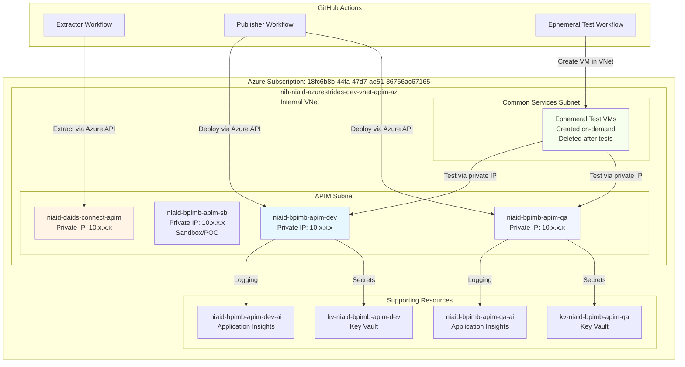
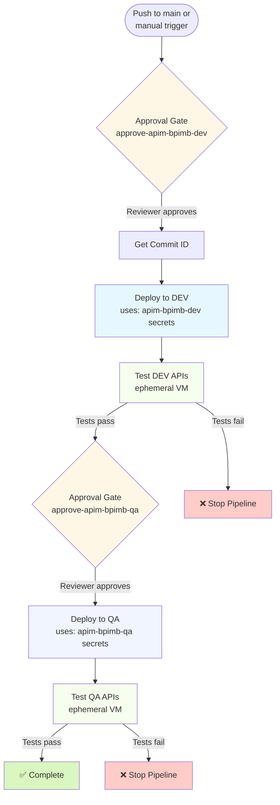
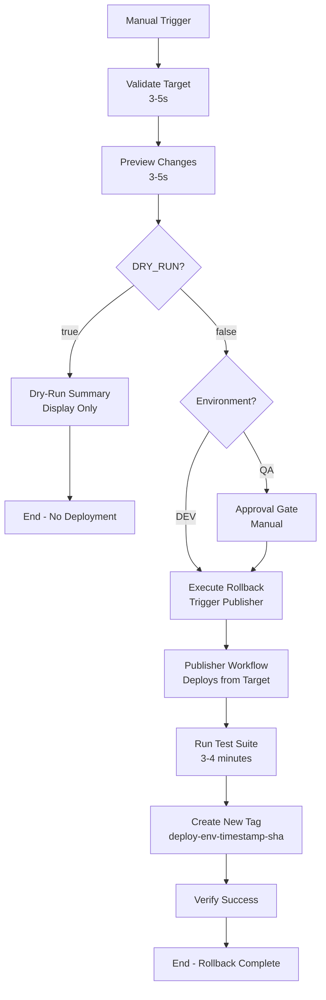
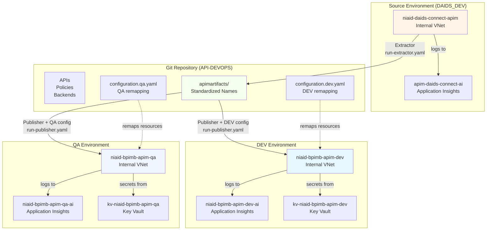
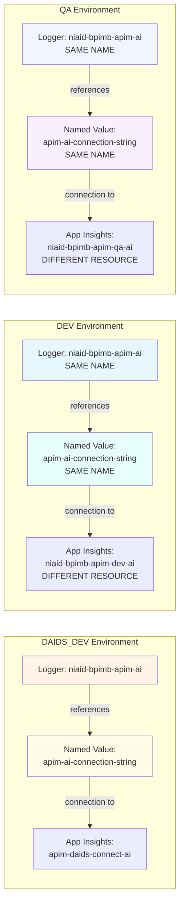
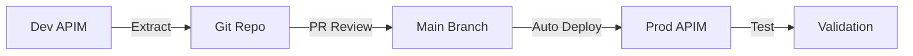

# NIAID Azure API Management DevOps Repository

## Table of Contents

- [Overview](#overview)
- [Environments](#environments)
  - [Network Architecture](#network-architecture)
- [Quick Start](#quick-start)
  - [Deploy an API Change](#deploy-an-api-change)
  - [Add a New API](#add-a-new-api)
  - [Run Tests Manually](#run-tests-manually)
  - [Trigger Extraction](#trigger-extraction)
  - [Rollback a Deployment](#rollback-a-deployment)
- [Repository Structure](#repository-structure)
  - [Artifact Structure Details](#artifact-structure-details)
- [Infrastructure Components](#infrastructure-components)
  - [Azure Resources](#azure-resources)
  - [API Inventory](#api-inventory)
- [GitHub Actions Workflows](#github-actions-workflows)
  - [Email Notifications Setup](#email-notifications-setup)
  - [1. Extract Artifacts](#1-extract-artifacts-run-extractoryaml)
  - [2. Publish to DEV and QA](#2-publish-to-dev-and-qa-run-publisheryaml)
  - [3. Reusable Publisher](#3-reusable-publisher-run-publisher-with-envyaml)
  - [4. API Testing](#4-api-testing-test-apisyaml)
  - [5. Ephemeral VM Testing](#5-ephemeral-vm-testing-test-apis-ephemeralyaml)
  - [6. VM Resource Cleanup Monitor](#6-vm-resource-cleanup-monitor-check-vm-cleanupyaml)
  - [7. Rollback Deployment](#7-rollback-deployment-rollback-deploymentyaml)
  - [8. Azure Advisor Compliance Check](#8-azure-advisor-compliance-check-check-advisoryaml)
  - [9. Cleanup Orphaned APIs](#9-cleanup-orphaned-apis-cleanup-orphaned-apisyaml)
  - [10. Check Orphaned Resources](#10-check-orphaned-resources-check-orphaned-resourcesyaml)
- [Configuration Files](#configuration-files)
  - [configuration.extractor.yaml](#configurationextractoryaml)
  - [configuration.dev.yaml and configuration.qa.yaml](#configurationdevyaml-and-configurationqayaml)
  - [Cross-Environment Resource Mapping Strategy](#cross-environment-resource-mapping-strategy)
- [Development Workflow](#development-workflow)
- [Deployment Architecture](#deployment-architecture)
- [Key Vault Integration](#key-vault-integration)
- [Testing Strategy](#testing-strategy)
- [Troubleshooting](#troubleshooting)
- [FAQ](#faq)
- [TODO / Roadmap](#todo--roadmap)

---

## Overview

This repository implements **GitOps for Azure API Management (APIM)** using Microsoft's [Azure APIops Toolkit](https://github.com/Azure/apiops). It automates the extraction, version control, and deployment of API Management artifacts across DAIDS_DEV, DEV, and QA environments.

### Key Features

- ✅ **Automated API Extraction** from DAIDS_DEV APIM to Git
- ✅ **Automated Deployment** to DEV and QA APIM via push to main branch
- ✅ **Version Control** for all APIM artifacts (APIs, policies, backends, products, etc.)
- ✅ **Environment-Specific Configuration** with Key Vault integration and environment remapping
- ✅ **Automated API Testing** using ephemeral Azure VMs for internal VNet testing
- ✅ **API Linting** with Spectral for OpenAPI specification quality
- ✅ **Internal VNet Support** for secure, private APIM instances
- ✅ **Key Vault Integration** for centralized secret management with RBAC

---

## Environments

This repository manages four APIM instances with six GitHub environments (four credential environments + two approval gates):

| GitHub Environment | Purpose | APIM Service | Resource Group | Network |
|-------------------|---------|--------------|----------------|---------|
| **apim-daids-connect** | Extractor source | niaid-daids-connect-apim | nih-niaid-azurestrides-dev-rg-apim-az | Internal VNet |
| **apim-bpimb-dev** | DEV deployment target | niaid-bpimb-apim-dev | nih-niaid-azurestrides-dev-rg-apim-az | Internal VNet |
| **apim-bpimb-qa** | QA deployment target | niaid-bpimb-apim-qa | nih-niaid-azurestrides-dev-rg-apim-az | Internal VNet |
| **approve-apim-bpimb-dev** | DEV approval gate | N/A - approval only | N/A | N/A |
| **approve-apim-bpimb-qa** | QA approval gate | N/A - approval only | N/A | N/A |

**Environment Secrets** (stored in GitHub environment settings):
- **apim-daids-connect**: `AZURE_CLIENT_ID`, `AZURE_TENANT_ID`, `AZURE_SUBSCRIPTION_ID`, `API_MANAGEMENT_SERVICE_NAME` (niaid-daids-connect-apim)
- **apim-bpimb-dev**: `AZURE_CLIENT_ID`, `AZURE_TENANT_ID`, `AZURE_SUBSCRIPTION_ID`, `API_MANAGEMENT_SERVICE_NAME` (niaid-bpimb-apim-dev), `APIM_SUBSCRIPTION_KEY`
- **apim-bpimb-qa**: `AZURE_CLIENT_ID`, `AZURE_TENANT_ID`, `AZURE_SUBSCRIPTION_ID`, `API_MANAGEMENT_SERVICE_NAME` (niaid-bpimb-apim-qa), `APIM_SUBSCRIPTION_KEY`

**Approval Environments** are configured with required reviewers to gate deployments to DEV and QA.

### Network Architecture

All APIM instances are deployed in internal VNets with no public access:



**Key Points**:
- No public IPs - all APIM instances accessible only within Azure VNet
- Ephemeral VMs created in same VNet for testing
- GitHub Actions uses Azure CLI/APIs (public endpoints) for management
- API testing requires VM inside VNet to reach private IPs

---

## Quick Start

### Deploy an API Change
```bash
# 1. Edit API artifacts in apimartifacts/
git add apimartifacts/apis/your-api/
git commit -m "feat: Update your-api specification"
git push origin main

# 2. GitHub Actions automatically deploys to DEV → QA (with approvals)
# Monitor: https://github.com/NIAID-BPIMB-whiters/API-DEVOPS/actions
```

### Add a New API
```bash
# 1. Run extractor to pull latest from DAIDS_DEV APIM
gh workflow run run-extractor.yaml

# 2. New API appears in apimartifacts/apis/new-api/
# 3. (Optional) Modify configuration.*.yaml to exclude from DEV/QA if needed
# 4. Commit and push - publisher workflow deploys automatically
```

### Run Tests Manually
```bash
# Test APIs in DEV environment
gh workflow run test-apis-ephemeral.yaml -f ENVIRONMENT=apim-bpimb-dev

# Test specific API only
gh workflow run test-apis-ephemeral.yaml -f ENVIRONMENT=apim-bpimb-dev -f APIS="echo-api"
```

### Trigger Extraction
```bash
# Pull latest APIM config from DAIDS_DEV
gh workflow run run-extractor.yaml
```

### Rollback a Deployment
```bash
# Step 1: List recent deployment tags
git fetch --tags
git tag -l "deploy-dev-*" --sort=-creatordate | head -5  # Last 5 DEV deployments
git tag -l "deploy-qa-*" --sort=-creatordate | head -5   # Last 5 QA deployments

# Step 2: View tag details
git show deploy-dev-20260112-214435-0015df2

# Step 3: Preview rollback (STRONGLY RECOMMENDED)
gh workflow run rollback-deployment.yaml \
  -f ENVIRONMENT=apim-bpimb-dev \
  -f ROLLBACK_TARGET=deploy-dev-20260112-214435-0015df2 \
  -f DRY_RUN=true

# Step 4: View dry-run results
gh run list --workflow=rollback-deployment.yaml --limit 1
gh run view <run-id>  # Check preview in Actions summary

# Step 5: Execute rollback after reviewing
gh workflow run rollback-deployment.yaml \
  -f ENVIRONMENT=apim-bpimb-dev \
  -f ROLLBACK_TARGET=deploy-dev-20260112-214435-0015df2 \
  -f DRY_RUN=false

# Step 6: Monitor execution
gh run watch <run-id>

# Emergency Option: Manual git revert (if Actions unavailable)
git revert <bad-commit-sha> --no-edit
git push origin main
# Publisher automatically redeploys previous configuration when Actions comes back
```

**Need more details?** See [Development Workflow](#development-workflow) and [Deployment Architecture](#deployment-architecture) sections below.

---

## Repository Structure

```
API-DEVOPS/
├── .github/
│   └── workflows/                           # GitHub Actions workflows
│       ├── run-extractor.yaml              # Extract artifacts from DEV APIM
│       ├── run-publisher.yaml              # Deploy artifacts to PROD APIM
│       ├── run-publisher-with-env.yaml     # Reusable deployment workflow
│       ├── test-apis.yaml                  # API testing (standard)
│       ├── test-apis-ephemeral.yaml        # API testing (ephemeral VM approach)
│       ├── rollback-deployment.yaml        # Rollback to previous deployment
│       ├── check-vm-cleanup.yaml           # Weekly VM resource cleanup monitor
│       └── check-advisor.yaml              # Azure Advisor compliance check
│
├── apimartifacts/                          # Source of truth for APIM configuration
│   ├── policy.xml                          # Global APIM policies (CORS, etc.)
│   ├── apis/                               # API definitions
│   │   ├── crms-api-qa/
│   │   ├── demo-conference-api/
│   │   ├── echo-api/
│   │   ├── itpms-chat-api/
│   │   ├── merlin-db/
│   │   ├── opentext/
│   │   ├── otcs-mcp-server/
│   │   └── test/
│   │       ├── apiInformation.json         # API metadata (path, protocols, etc.)
│   │       ├── specification.yaml          # OpenAPI specification
│   │       ├── policy.xml                  # API-level policies (optional)
│   │       └── operations/                 # Operation-level policies (optional)
│   ├── backends/                           # Backend service definitions
│   │   ├── niaid-azure-oaipoc-api-fa/
│   │   ├── opentext-mcp-sop-policies-backend-*/
│   │   └── WebApp_nih-niaid-bpimb-mcp-opentext-wa/
│   ├── diagnostics/                        # Logging and monitoring config
│   │   ├── applicationinsights/
│   │   └── azuremonitor/
│   ├── gateways/                           # Self-hosted gateway configs
│   │   ├── NIAID_CRMS_Test/
│   │   └── test-echo/
│   ├── groups/                             # User groups
│   ├── loggers/                            # Logger configurations
│   │   ├── niaid-bpimb-apim-ai/           # Standardized logger (all environments)
│   │   └── azuremonitor/                  # Azure Monitor logger
│   ├── named values/                       # Configuration values and secrets
│   │   └── apim-ai-connection-string/     # App Insights connection (environment-specific value)
│   ├── products/                           # API product bundles
│   │   ├── merlinws/
│   │   ├── starter/
│   │   └── unlimited/
│   ├── subscriptions/                      # API subscription keys
│   └── tags/                               # Organizational tags
│
├── dev-extracted/                          # Historical extractions (reference only)
│   └── artifacts-from-portal/
│
├── configuration.extractor.yaml            # Extraction configuration
├── configuration.dev.yaml                  # DEV deployment configuration
├── configuration.qa.yaml                   # QA deployment configuration
└── README.md                               # This file
```

### Artifact Structure Details

Each API in `apimartifacts/apis/` contains:

- **`apiInformation.json`**: Core API metadata
  - Display name, path, protocols
  - Service URL (backend)
  - Subscription settings
  - Authentication configuration

- **`specification.yaml`**: OpenAPI 3.0 specification
  - Endpoints, parameters, schemas
  - Request/response definitions
  - Validated by Spectral linting

- **`policy.xml`**: API-level policies (optional)
  - Authentication, rate limiting
  - Request/response transformation
  - Custom business logic

- **`operations/`**: Operation-specific policies (optional)
  - Individual endpoint overrides
  - Per-operation transformation

---

## Infrastructure Components

### Azure Resources

#### DAIDS_DEV Environment (Extractor Source)
- **APIM Service**: `apim-daids-connect`
  - Resource Group: `nih-niaid-avidpoc-dev-rg`
  - Region: `eastus`
  - SKU: `Developer`
  - Network: Internal VNet (`nih-niaid-azurestrides-dev-apim-az`)
  - Gateway: `apim-daids-connect.azure-api.net` (Private IP: `10.178.57.52`)
  - Purpose: Source for artifact extraction

- **Application Insights**: `apim-daids-connect-ai`
  - Resource Group: `nih-niaid-avidpoc-dev-rg`
  - Region: `eastus`
  - Instrumentation Key: `98066d90-6565-4993-b071-c5a453f2ce44`
  - Purpose: APIM diagnostics and logging

#### Sandbox Environment (POC Development)
- **APIM Service**: `niaid-bpimb-apim-sb`
  - Resource Group: `niaid-bpimb-apim-sb-rg`
  - Region: `eastus`
  - SKU: `Developer`
  - Network: Internal VNet (TBD - pending APIM provisioning completion)
  - Gateway: `niaid-bpimb-apim-sb.azure-api.net`
  - Purpose: Experimental/POC development, manual promotion to DEV
  - **Status**: ⏳ Provisioning (30-45 minutes)

- **Application Insights**: `niaid-bpimb-apim-sb-ai`
  - Resource Group: `niaid-bpimb-apim-sb-rg`
  - Region: `eastus`
  - Connection String: Stored in Key Vault
  - Purpose: Sandbox APIM diagnostics and logging

- **Key Vault**: `kv-niaid-apim-sb`
  - Resource Group: `niaid-bpimb-apim-sb-rg`
  - Region: `eastus`
  - Purpose: Sandbox secrets management (App Insights connection string)

- **Service Principal**: `apiops-sb-sp`
  - App ID: `e493d820-c4d2-45d3-b66d-e46459cfa4c2`
  - Purpose: Dedicated sandbox environment access
  - Created: January 13, 2026

#### DEV Environment (Deployment Target)
- **APIM Service**: `niaid-bpimb-apim-dev`
  - Resource Group: `niaid-bpimb-apim-dev-rg`
  - Region: `eastus2`
  - SKU: `Developer`
  - Network: Internal VNet (`nih-niaid-azurestrides-bpimb-dev-apim-az`)
  - Gateway: `niaid-bpimb-apim-dev.azure-api.net` (Private IP: `10.179.0.4`)
  - Purpose: Target for automated deployments

- **Application Insights**: `niaid-bpimb-apim-dev-ai`
  - Resource Group: `niaid-bpimb-apim-dev-rg`
  - Region: `eastus2`
  - Instrumentation Key: `369236ca-f1b0-43f7-a58e-036094365a7c`
  - Purpose: APIM diagnostics and logging

#### QA Environment
- **APIM Service**: `niaid-bpimb-apim-qa`
  - Resource Group: `niaid-bpimb-apim-qa-rg`
  - Region: `eastus2`
  - SKU: `Developer`
  - Network: Internal VNet (`nih-niaid-azurestrides-bpimb-qa-apim-az`)
  - Gateway: `niaid-bpimb-apim-qa.azure-api.net` (Private IP: `10.180.0.4`)
  - Purpose: QA/Testing environment
  - **Status**: ✅ Configured and ready for deployment

- **Application Insights**: `niaid-bpimb-apim-qa-ai`
  - Resource Group: `niaid-bpimb-apim-qa-rg`
  - Region: `eastus2`
  - Instrumentation Key: `6540b7ee-bd2a-4529-9242-d8ca2749a6cd`
  - Purpose: APIM diagnostics and logging

- **Service Principal**: `github-apidevops-qa`
  - App ID: `7a03a242-6e15-4a00-84a7-a772988a5b71`
  - Purpose: Dedicated QA environment access
  - Created: December 26, 2025

#### Network Configuration

**DAIDS_DEV VNet** (`nih-niaid-azurestrides-dev-apim-az`):
- Address Space: `10.178.57.0/24`
- APIM Subnet: `niaid-apim` (`10.178.57.48/28`)
- Test VM Subnet: `niaid-commonservices-test` (`10.178.57.64/27`)

**DEV VNet** (`nih-niaid-azurestrides-bpimb-dev-apim-az`):
- Address Space: `10.179.0.0/24`
- APIM Subnet: `dev-apim-subnet` (`10.179.0.0/28`)
- Test VM Subnet: `dev-commonservices` (`10.179.0.32/27`)

**QA VNet** (`nih-niaid-azurestrides-bpimb-qa-apim-az`):
- Address Space: `10.180.0.0/24`
- APIM Subnet: `qa-apim-subnet` (`10.180.0.0/28`)
- Test VM Subnet: `qa-commonservices` (`10.180.0.32/27`)
- **Status**: ✅ Complete - VNet configured and APIM migrated

### API Inventory

Currently managing **7 APIs** across all environments:

| API Name | Purpose | Path |
|----------|---------|------|
| `crms-api-qa` | Clinical Research Management System (QA) | `/crms-api-qa` |
| `demo-conference-api` | Demo API for conference showcase | `/conference` |
| `echo-api` | Testing/debugging echo service | `/echo` |
| `merlin-db` | Merlin database API | `/merlin-db` |
| `opentext` | OpenText document management | `/opentext` |
| `otcs-mcp-server` | OpenText Content Server MCP | `/otcs-mcp` |
| `test` | General testing API | `/test` |

> **Note**: `itpms-chat-api` was removed on December 26, 2025 as part of POC cleanup. See [POC-EXPORT-niaid-azure-oaipoc-api-fa.md](POC-EXPORT-niaid-azure-oaipoc-api-fa.md) for archived configuration.

---

## GitHub Actions Workflows

### Email Notifications Setup

To receive email notifications when VM cleanup is required or workflows fail:

1. **Configure GitHub Notifications**:
   - Go to [GitHub Settings → Notifications](https://github.com/settings/notifications)
   - Enable **Actions** under "Actions" section
   - Choose delivery method: **Email**, **Web**, or **Mobile**

2. **Repository-Level Notifications**:
   - Visit this repository on GitHub
   - Click **Watch** → **Custom** → Enable **Actions**
   - This ensures you receive notifications for workflow failures

3. **What You'll Receive**:
   - 📧 **VM Cleanup Alerts**: Email when orphaned VMs/NICs/disks detected (weekly)
   - ⚠️ **Workflow Failures**: Immediate notification when deployments fail
   - 📊 **Reports**: Download detailed reports from workflow artifacts

4. **Testing Notifications**:
   ```bash
   # Trigger a manual cleanup check
   gh workflow run check-vm-cleanup.yaml
   
   # View the results
   gh run list --workflow=check-vm-cleanup.yaml --limit 1
   gh run view <run-id>
   ```

---

### 1. Extract Artifacts (`run-extractor.yaml`)

**Purpose**: Extract APIM artifacts from DAIDS_DEV environment to Git repository

**Trigger**: Manual workflow dispatch

**Pipeline Flow**:
```
DAIDS_DEV APIM (apim-daids-connect) → Extractor Tool → apimartifacts/ folder → Git commit
```

**Configuration Options**:
- **Extract All APIs**: Extracts all artifacts from DAIDS_DEV APIM
- **Use configuration.extractor.yaml**: Selectively extract specific APIs/artifacts

**Environment Variables**:
- Uses `daids_dev` environment secrets
- `AZURE_CLIENT_ID`, `AZURE_CLIENT_SECRET`, `AZURE_TENANT_ID`
- `AZURE_SUBSCRIPTION_ID`, `AZURE_RESOURCE_GROUP_NAME`
- `API_MANAGEMENT_SERVICE_NAME`

**Tool Version**: Azure APIops `v6.0.2`

**Usage**:
```bash
# Extract all APIs
gh workflow run run-extractor.yaml -f CONFIGURATION_YAML_PATH="Extract All APIs"

# Extract specific APIs defined in configuration
gh workflow run run-extractor.yaml -f CONFIGURATION_YAML_PATH="configuration.extractor.yaml"
```

---

### 2. Publish to DEV and QA (`run-publisher.yaml`)

**Purpose**: Deploy artifacts from repository to DEV and QA APIM environments

**Trigger**: 
- Push to `main` branch (automatic)
- Manual workflow dispatch

**Pipeline Flow**:
```
Git Repository (apimartifacts/) → Publisher Tool → DEV APIM → Test DEV → QA APIM → Test QA
```

**Deployment Modes**:

1. **Incremental Deployment** (default on push to main):
   - Only deploys changed artifacts from last commit
   - Uses Git commit ID to identify changes
   - Faster, lower risk

2. **Full Deployment** (manual option):
   - Redeploys all artifacts in repository
   - Used for disaster recovery or after build failures
   - Select "publish-all-artifacts-in-repo" option

### Deployment Modes Explained

The publisher supports two deployment modes with different use cases and performance characteristics:

#### Incremental Deployment (publish-artifacts-in-last-commit)

**How It Works**:
- Publisher uses `COMMIT_ID` parameter to identify changed files
- Internally compares `HEAD` (current commit) with `HEAD~1` (previous commit)
- Only artifacts modified in the last commit are sent to APIM
- APIops processes changed files and updates corresponding APIM resources

**Performance**:
- ~30-50% faster than full deployment (depending on change size)
- Example: Updating 1 API policy takes ~20 seconds vs ~45 seconds for full deployment
- Network transfer reduced (only changed files uploaded)

**When to Use**:
- ✅ Normal deployments (default on push to main)
- ✅ Single API updates or policy changes
- ✅ Configuration-only changes (named values, backends)
- ✅ When you know exactly what changed in your commit

**Safety**:
- Safe for most changes - Git tracks modifications accurately
- APIops validates artifacts before applying changes
- Post-deployment tests catch any issues

**Example**:
```bash
# Automatic on push
git commit -m "Update echo-api policy"
git push origin main  # Triggers incremental deployment

# Manual trigger
gh workflow run run-publisher.yaml -f COMMIT_ID_CHOICE="publish-artifacts-in-last-commit"
```

#### Full Deployment (publish-all-artifacts-in-repo)

**How It Works**:
- Publisher processes ALL artifacts in `apimartifacts/` folder
- No commit comparison - every file is sent to APIM
- APIops updates all resources regardless of whether they changed
- APIM performs diff and only applies actual changes

**Performance**:
- Slower (~45-60 seconds for typical repository)
- Processes all APIs, policies, backends, products, named values, etc.
- More network transfer and API calls to APIM

**When to Use**:
- ✅ Disaster recovery (rebuild APIM from repository)
- ✅ After manual APIM changes need to be overwritten
- ✅ Sync issues (APIM state doesn't match repository)
- ✅ First deployment to new environment
- ✅ After build/deployment failures (ensure complete state)
- ✅ When unsure if incremental captured all changes

**Use Cases**:
```bash
# Rebuild DEV environment after manual portal changes
gh workflow run run-publisher.yaml -f COMMIT_ID_CHOICE="publish-all-artifacts-in-repo"

# Fix sync issues
git pull origin main
gh workflow run run-publisher.yaml -f COMMIT_ID_CHOICE="publish-all-artifacts-in-repo"
```

#### Troubleshooting Deployment Modes

| Issue | Likely Cause | Solution |
|-------|-------------|----------|
| API not updating after commit | Changed file not detected by Git | Run full deployment to force update |
| "Resource not found" error | Incremental trying to update deleted resource | Run full deployment to sync state |
| Deployment slower than expected | Running full mode unnecessarily | Use incremental for single-file changes |
| APIM has manual changes | Changes made in portal, not in repository | Run full deployment to overwrite |
| Policy changes not applying | Policy file not committed or Git diff issue | Verify commit, use full deployment |

#### Best Practices

1. **Default to Incremental**: Faster, less load on APIM, easier to review changes
2. **Use Full for Recovery**: When APIM state is unknown or potentially corrupted
3. **Test After Deployment**: Both modes trigger post-deployment tests automatically
4. **Monitor First Run**: First deployment to new environment should use full mode
5. **Document Manual Changes**: If you make manual APIM changes, document and use full deployment to sync

**Features**:
- ✅ **API Specification Linting**: Validates OpenAPI specs with Spectral
- ✅ **Environment-Specific Configuration**: Remaps Key Vault URLs and resource references per environment
- ✅ **Post-Deployment Testing**: Triggers full API test suite on DEV, gates QA deployment
- ✅ **Logging**: Configurable log levels (Information, Debug, etc.)
- ✅ **Test Gate**: QA deployment waits for DEV tests to pass
- ✅ **Manual Approval**: Both DEV and QA deployments require approval from designated reviewers

**Deployment Tagging**:

Every successful deployment (after tests pass) is automatically tagged for rollback capability:
- **Tag Format**: `deploy-{environment}-{timestamp}-{short-sha}`
- **Example**: `deploy-dev-20260112-190042-4d53845`
- **Created By**: Tag-DEV-Deployment and Tag-QA-Deployment jobs
- **Metadata Includes**: Deployer name, workflow run ID, test status
- **Purpose**: Enable quick rollback to known-good states

Tags are created automatically as part of the publisher workflow sequence:
```
Deploy → Test → Tag (if tests pass) → Cleanup Orphaned APIs
```

**Approval Workflow**:



Steps:
1. Workflow triggers (push to main or manual run)
2. ⏸️  **Pauses before DEV deployment** - awaits approval
3. Designated reviewer approves via GitHub Actions UI
4. ✅ Deploys to DEV and runs tests
5. ⏸️  **Pauses before QA deployment** - awaits approval (after DEV tests pass)
6. Designated reviewer approves
7. ✅ Deploys to QA and runs tests

**Configure Approvers**:
```
GitHub → Settings → Environments → dev/qa → Required reviewers
```

### Approval Architecture

The deployment workflow uses **two separate environments for each deployment target** to prevent multiple approval prompts:

| Environment Name | Type | Purpose | Contains |
|-----------------|------|---------|----------|
| `approve-apim-bpimb-dev` | Approval Gate | Pause before DEV deployment | Required reviewers only |
| `apim-bpimb-dev` | Credential Store | Azure authentication | Secrets (Client ID, Subscription, etc.) |
| `approve-apim-bpimb-qa` | Approval Gate | Pause before QA deployment | Required reviewers only |
| `apim-bpimb-qa` | Credential Store | Azure authentication | Secrets (Client ID, Subscription, etc.) |

**Why Two Environments Per Target?**

Without this separation, deployment jobs would need to reference the same environment twice:
1. Once for approval (at job start)
2. Once for secrets (inside reusable workflow)

**Problem**: GitHub Actions only prompts for approval **once per environment per workflow run**. If a job references the same environment multiple times, the second reference gets skipped, causing the job to fail due to missing secrets.

**Solution**: 
- **Approval environments** (`approve-*`) contain only required reviewers, no secrets
- **Credential environments** (`apim-*`) contain only secrets, no reviewers
- Jobs reference approval environment first (triggers review), then call reusable workflow that uses credential environment (accesses secrets)

**Example from run-publisher.yaml**:
```yaml
# Approval job - references approval environment
approve-dev-deployment:
  runs-on: ubuntu-latest
  environment: 
    name: approve-apim-bpimb-dev  # Contains reviewers, no secrets
  steps:
    - name: DEV deployment approved
      run: echo "Proceeding with DEV deployment..."

# Deployment job - references credential environment via reusable workflow
Deploy-To-DEV-With-Commit-ID:
  needs: approve-dev-deployment
  uses: ./.github/workflows/run-publisher-with-env.yaml
  with:
    API_MANAGEMENT_ENVIRONMENT: apim-bpimb-dev # Contains secrets, no reviewers
    CONFIGURATION_YAML_PATH: configuration.dev.yaml
  secrets: inherit
```

**Configuration Steps**:

1. **Create Approval Environments** (GitHub Settings → Environments):
   - Create `approve-apim-bpimb-dev`
   - Add required reviewers (e.g., team leads)
   - ❌ Do NOT add any secrets

2. **Create Credential Environments** (GitHub Settings → Environments):
   - Create `apim-bpimb-dev`
   - Add Azure secrets: `AZURE_CLIENT_ID`, `AZURE_TENANT_ID`, `AZURE_SUBSCRIPTION_ID`, `API_MANAGEMENT_SERVICE_NAME`, `APIM_SUBSCRIPTION_KEY`
   - ❌ Do NOT add required reviewers

3. **Repeat for QA**: Create `approve-apim-bpimb-qa` (reviewers only) and `apim-bpimb-qa` (secrets only)

**Troubleshooting Approval Issues**:

| Issue | Cause | Solution |
|-------|-------|----------|
| Deployment skips approval | Approval environment missing required reviewers | Add reviewers to `approve-*` environment |
| "Secret not found" error | Secrets in wrong environment | Move secrets to `apim-*` environment (not `approve-*`) |
| Multiple approval prompts | Secrets in approval environment | Remove secrets from `approve-*`, add to `apim-*` only |
| Approval doesn't pause workflow | Job doesn't reference approval environment | Check job has `environment: name: approve-*` |

---

**Usage**:
```bash
# Automatic on push to main (incremental)
git push origin main

# Manual full redeployment
gh workflow run run-publisher.yaml -f COMMIT_ID_CHOICE="publish-all-artifacts-in-repo"

# Manual incremental deployment
gh workflow run run-publisher.yaml -f COMMIT_ID_CHOICE="publish-artifacts-in-last-commit"
```

---

### 3. Reusable Publisher (`run-publisher-with-env.yaml`)

**Purpose**: Reusable workflow for environment-specific deployments

**Called By**: `run-publisher.yaml`

**Inputs**:
- `API_MANAGEMENT_ENVIRONMENT`: Target environment (dev/prod)
- `CONFIGURATION_YAML_PATH`: Configuration file path
- `COMMIT_ID`: Git commit for incremental deployment (optional)
- `API_MANAGEMENT_SERVICE_OUTPUT_FOLDER_PATH`: Artifacts folder

**Steps**:
1. Checkout repository
2. Run Spectral linting on OpenAPI specs
3. Perform secret substitution in configuration files
4. Download Azure APIops publisher tool
5. Execute publisher with appropriate parameters

---

### 4. API Testing (`test-apis.yaml`)

**Purpose**: Standard API testing workflow

**Trigger**: Manual workflow dispatch

**Runner Types**:
- **Production**: GitHub-hosted runners (`ubuntu-latest`)
- **Development**: Self-hosted runners (internal network access)

**Test Types**:

1. **Health Check**: 
   - Validates APIM gateway responds
   - Accepts HTTP 404, 401, 403 as healthy

2. **Endpoint Availability**:
   - Tests all API endpoints
   - Accepts HTTP 200, 401, 403, 404

3. **Full Suite**:
   - Runs all test types

**Usage**:
```bash
# Test prod environment health
gh workflow run test-apis.yaml -f ENVIRONMENT=prod -f TEST_TYPE=health-check

# Test specific API
gh workflow run test-apis.yaml -f ENVIRONMENT=prod -f API_NAME=echo-api -f TEST_TYPE=endpoint-availability

# Run full test suite
gh workflow run test-apis.yaml -f ENVIRONMENT=prod -f TEST_TYPE=full-suite
```

---

### 5. Ephemeral VM Testing (`test-apis-ephemeral.yaml`)

**Purpose**: Test internal APIM instances using temporary Azure VMs

**Why Needed**: 
- APIM instances are in internal VNets (not publicly accessible)
- No persistent self-hosted runners required
- Tests from within Azure network boundary

**How It Works**:

```
1. CREATE → Provision Ubuntu VM in APIM VNet (Standard_B1s)
2. TEST   → Run tests via az vm run-command with private IP
3. CLEANUP → Delete VM automatically (success or failure)
```

**Features**:
- ✅ No persistent infrastructure costs
- ✅ Automatic cleanup (even on failure)
- ✅ Network diagnostics included
- ✅ Tests using private IPs within VNet

**Workflow Steps**:

1. **Create Test VM**:
   - VM Name: `test-runner-<timestamp>`
   - Image: Ubuntu2204
   - Size: Standard_B1s (minimal cost)
   - Network: Same VNet as APIM, no public IP
   - Location: Same subnet as commonservices

2. **Run Tests**:
   - Detect APIM private IP using `az vm run-command`
   - Execute PowerShell test scripts on VM
   - Test gateway health or API endpoints

3. **Cleanup**:
   - Always runs (`if: always()`)
   - Deletes VM and all associated resources
   - Total VM lifetime: ~5-10 minutes

**Usage**:
```bash
# Test dev environment
gh workflow run test-apis-ephemeral.yaml -f ENVIRONMENT=dev -f TEST_TYPE=health-check

# Test specific API in prod
gh workflow run test-apis-ephemeral.yaml -f ENVIRONMENT=prod -f API_NAME=opentext -f TEST_TYPE=endpoint-availability

# Full suite on prod
gh workflow run test-apis-ephemeral.yaml -f ENVIRONMENT=prod -f TEST_TYPE=full-suite
```

**Cost**: ~$0.01-0.02 per test run (5-10 minutes of B1s VM time)

---

### 6. VM Resource Cleanup Monitor (`check-vm-cleanup.yaml`)

**Purpose**: Monitor for orphaned test VM resources and send email notifications when cleanup is needed

**Trigger**: 
- Weekly schedule (Mondays at 9 AM UTC)
- Manual workflow dispatch

**Features**:
- ✅ Scans for orphaned test-runner VMs
- ✅ Detects unattached NICs from failed cleanup
- ✅ Identifies orphaned disks consuming storage
- ✅ Generates detailed cleanup report with commands
- ✅ Sends email notification on failures (via workflow failure)
- ✅ Provides automated cleanup scripts
- ✅ Tracks resource creation dates and sizes

**What It Checks**:
1. **Virtual Machines**: Any VMs matching `test-runner-*` pattern
2. **Network Interfaces**: NICs matching `test-runner-*` that aren't attached to VMs
3. **Disks**: Unattached disks matching `test-runner-*` pattern

**Usage**:
```bash
# Manual check
gh workflow run check-vm-cleanup.yaml

# View latest report
gh run list --workflow=check-vm-cleanup.yaml --limit 1
gh run view <run-id>
gh run download <run-id>  # Download the cleanup report
```

**Email Notifications**:

The workflow fails when orphaned resources are detected, triggering GitHub's email notification system:

- ⚠️ **Cleanup Required**: Workflow fails and sends email when issues found
- ✅ **All Clear**: Workflow succeeds silently (no email by default)
- 📧 **Recipients**: All users with GitHub notifications enabled for the repository
- 📊 **Report**: Detailed cleanup report available as downloadable artifact

**How to Receive Notifications**:
1. Configure your GitHub notification preferences at [Settings → Notifications](https://github.com/settings/notifications)
2. Enable "Actions" notifications for failures
3. You'll receive emails automatically when cleanup is required
4. Download detailed cleanup report from workflow artifacts

**Cleanup Report Includes**:
- Summary table of orphaned resources by type
- Detailed list with creation dates and sizes
- Individual cleanup commands for each resource
- Automated cleanup script for batch operations
- Impact analysis (cost, IP exhaustion risk)

**Manual Cleanup (if needed)**:
```bash
# Login to Azure
az login
az account set --subscription <subscription-id>

# Delete all orphaned test VMs
az vm list --resource-group nih-niaid-azurestrides-dev-rg-admin-az \
  --query "[?starts_with(name, 'test-runner-')].name" -o tsv | \
  xargs -I {} az vm delete --resource-group nih-niaid-azurestrides-dev-rg-admin-az --name {} --yes

# Delete all orphaned NICs
az network nic list --resource-group nih-niaid-azurestrides-dev-rg-admin-az \
  --query "[?starts_with(name, 'test-runner-') && virtualMachine == null].name" -o tsv | \
  xargs -I {} az network nic delete --resource-group nih-niaid-azurestrides-dev-rg-admin-az --name {}

# Delete all orphaned disks
az disk list --resource-group nih-niaid-azurestrides-dev-rg-admin-az \
  --query "[?starts_with(name, 'test-runner-') && diskState == 'Unattached'].name" -o tsv | \
  xargs -I {} az disk delete --resource-group nih-niaid-azurestrides-dev-rg-admin-az --name {} --yes
```

**Why This Matters**:
- 💰 **Cost Savings**: Orphaned VMs continue to incur charges
- 🌐 **IP Exhaustion**: Orphaned NICs consume subnet IP addresses
- 🔒 **Security**: Prevents accumulation of unmanaged resources
- 📊 **Compliance**: Maintains clean Azure environment

**Troubleshooting**:

If you receive false positive notifications:

1. **Check Timing**: Ensure the workflow doesn't run during active testing
2. **Verify Cleanup Jobs**: Confirm ephemeral test workflows have `if: always()` on cleanup steps
3. **Review Workflow Logs**: Check recent test-apis-ephemeral runs for cleanup failures
4. **Service Principal Permissions**: Ensure SP has permissions to delete resources in the resource group

---

### 7. Rollback Deployment (`rollback-deployment.yaml`)

**Purpose**: Safely rollback APIM deployments to a previous known-good state

**Trigger**: Manual workflow dispatch only

**Status**: ✅ **Production-ready** - Successfully tested on January 12, 2026

**Features**:
- ✅ Rollback to specific deployment tags or commit SHAs
- ✅ Dry run mode to preview changes before deploying
- ✅ Automatic validation of rollback target
- ✅ Diff preview showing what will change
- ✅ Approval gates for QA rollbacks (DEV rollbacks require no approval)
- ✅ Post-rollback verification tests
- ✅ Deployment audit trail
- ✅ Automatic creation of new deployment tag after successful rollback
- ✅ Works with tag-based rollbacks (recommended) and commit SHA rollbacks

**Automatic Deployment Tagging**:

Every successful deployment (with passing tests) is automatically tagged:
- **Format**: `deploy-{env}-{timestamp}-{short-sha}`
- **Example**: `deploy-dev-20260112-214435-0015df2`
- **Metadata**: Includes deployer, timestamp, workflow ID
- **Created by**: `Tag-DEV-Deployment` and `Tag-QA-Deployment` jobs in publisher workflow
- **Trigger**: Runs after successful tests (Test-DEV-After-Deploy / Test-QA-After-Deploy)

**Production Test Results (January 12, 2026)**:

Successfully executed end-to-end rollback workflow:
- ✅ Created breaking change (forced 500 error in test API)
- ✅ Deployed breaking change to DEV (tag: `deploy-dev-20260112-205014-d4dd75e`)
- ✅ Executed dry-run rollback preview (workflow 20935089785)
- ✅ Executed actual rollback to previous good state (tag: `deploy-dev-20260112-201504-0015df2`)
- ✅ New deployment tag created: `deploy-dev-20260112-214435-0015df2`
- ✅ Post-rollback verification tests passed
- ⏱️ **Total recovery time**: ~6 minutes (dry-run + actual rollback)

---

## 🚨 Step-by-Step Recovery Guide

**Scenario**: A deployment to DEV or QA has caused API failures and you need to rollback immediately.

### Step 1: Identify the Problem

**Symptoms that require rollback**:
- APIs returning 500/502/503 errors
- Authentication/authorization failures
- Policy violations causing request failures
- Backend service connectivity issues after deployment
- Breaking changes in API specifications

**Verify the issue**:
```bash
# Check recent publisher deployments
gh run list --workflow=run-publisher.yaml --limit 5

# Check test results
gh run list --workflow=test-apis-ephemeral.yaml --limit 3
gh run view <test-run-id> --log | grep -i "error\|failed\|500\|502\|503"

# Check APIM directly (if you have access)
curl -H "Ocp-Apim-Subscription-Key: $KEY" https://niaid-bpimb-apim-dev.azure-api.net/your-api
```

### Step 2: Find Available Deployment Tags

**Every successful deployment automatically creates a tag**. These tags are your rollback points.

```bash
# Sync tags from GitHub (IMPORTANT - run this first!)
git fetch --tags --force

# List recent DEV deployments (most recent first)
git tag -l "deploy-dev-*" --sort=-creatordate | head -10

# Example output:
# deploy-dev-20260112-214435-0015df2  <- Current (may be broken)
# deploy-dev-20260112-201504-0015df2  <- Last known good
# deploy-dev-20260112-190042-4d53845
# deploy-dev-20260111-153022-a1b2c3d
# ...

# List recent QA deployments (most recent first)
git tag -l "deploy-qa-*" --sort=-creatordate | head -10

# List ALL deployment tags with timestamps
git for-each-ref --sort=-creatordate --format '%(creatordate:short) %(refname:short)' refs/tags/deploy-*
```

**Understanding tag names**:
- `deploy-dev-20260112-214435-0015df2`
  - `deploy` = deployment tag
  - `dev` = DEV environment (or `qa` for QA)
  - `20260112` = date (YYYYMMDD = January 12, 2026)
  - `214435` = time (HHMMSS = 21:44:35 / 9:44:35 PM)
  - `0015df2` = git commit short SHA

### Step 3: Select the Rollback Target

**Method A: Use the previous tag (most common)**
```bash
# Get the last TWO deployments
git tag -l "deploy-dev-*" --sort=-creatordate | head -2

# Output example:
# deploy-dev-20260112-214435-0015df2  <- CURRENT (broken)
# deploy-dev-20260112-201504-0015df2  <- USE THIS for rollback
```

**Method B: Investigate commit history**
```bash
# View what changed in each deployment
git show deploy-dev-20260112-214435-0015df2  # Current broken deployment
git show deploy-dev-20260112-201504-0015df2  # Previous deployment

# View commit log between tags
git log deploy-dev-20260112-201504-0015df2..deploy-dev-20260112-214435-0015df2 --oneline

# Example output:
# d4dd75e test: Add breaking change to test API for rollback testing
# ^ This shows what will be rolled back

# View actual file changes
git diff deploy-dev-20260112-201504-0015df2 deploy-dev-20260112-214435-0015df2 -- apimartifacts/
```

**Method C: Check workflow runs to find last successful deployment**
```bash
# List publisher runs with their status
gh run list --workflow=run-publisher.yaml --limit 10 --json conclusion,createdAt,headSha

# Find the last successful run BEFORE the problem
# Note the commit SHA and find its deployment tag
git tag --contains <commit-sha> | grep deploy-dev
```

### Step 4: Preview the Rollback (DRY RUN)

**ALWAYS preview before executing** - this shows you exactly what will change.

```bash
# Run dry-run preview
gh workflow run rollback-deployment.yaml \
  -f ENVIRONMENT=apim-bpimb-dev \
  -f ROLLBACK_TARGET=deploy-dev-20260112-201504-0015df2 \
  -f DRY_RUN=true

# Wait a few seconds for workflow to start
sleep 5

# Get the workflow run ID
gh run list --workflow=rollback-deployment.yaml --limit 1 --json databaseId,status --jq '.[0] | .databaseId'

# View the preview (opens in browser)
gh run view <run-id> --web

# Or view in terminal
gh run watch <run-id>
```

**Review the dry-run output**:
- ✅ "Commits Being Rolled Back" - shows what commits will be undone
- ✅ "Files That Will Change" - shows which files will be modified
- ✅ "APIs Affected" - shows how many APIs will be updated
- ⚠️ Look for warnings about API specification changes

### Step 5: Execute the Rollback

**After reviewing the preview and confirming it's correct**:

```bash
# Execute the rollback (NO dry-run flag)
gh workflow run rollback-deployment.yaml \
  -f ENVIRONMENT=apim-bpimb-dev \
  -f ROLLBACK_TARGET=deploy-dev-20260112-201504-0015df2 \
  -f DRY_RUN=false

# Get the workflow run ID
sleep 5
RUN_ID=$(gh run list --workflow=rollback-deployment.yaml --limit 1 --json databaseId --jq '.[0].databaseId')
echo "Rollback workflow: $RUN_ID"

# Monitor execution in real-time
gh run watch $RUN_ID

# Or check status periodically
watch -n 10 "gh run view $RUN_ID"
```

**For QA rollbacks**: You'll need to approve the deployment manually:
```bash
# After workflow starts, go to GitHub Actions UI
gh run view $RUN_ID --web

# Click "Review deployments" button
# Select "approve-qa-rollback" environment
# Click "Approve and deploy"
```

### Step 6: Verify Rollback Success

**The rollback workflow automatically**:
- ✅ Triggers the publisher to deploy the rollback target
- ✅ Runs test suite to verify APIs are working
- ✅ Creates a new deployment tag (e.g., `deploy-dev-20260112-221500-0015df2`)

**Manual verification steps**:

```bash
# 1. Check rollback workflow completed successfully
gh run view $RUN_ID

# 2. Check the publisher workflow triggered by rollback
gh run list --workflow=run-publisher.yaml --limit 1
PUBLISHER_RUN=$(gh run list --workflow=run-publisher.yaml --limit 1 --json databaseId --jq '.[0].databaseId')
gh run view $PUBLISHER_RUN

# 3. Check test results
gh run list --workflow=test-apis-ephemeral.yaml --limit 1
TEST_RUN=$(gh run list --workflow=test-apis-ephemeral.yaml --limit 1 --json databaseId --jq '.[0].databaseId')
gh run view $TEST_RUN

# 4. Verify new deployment tag was created
git fetch --tags
git tag -l "deploy-dev-*" --sort=-creatordate | head -3
# Should show a new tag with the same commit SHA as your rollback target

# 5. Test APIs manually
curl -H "Ocp-Apim-Subscription-Key: $KEY" https://niaid-bpimb-apim-dev.azure-api.net/your-api
# Should return expected response (not 500/502/503)
```

### Step 7: Clean Up Repository (Recommended)

**After successful rollback**, the broken code is still in the main branch. You should remove it:

```bash
# View recent commits
git log --oneline -5

# Revert the bad commit(s)
git revert d4dd75e --no-edit  # Replace with actual bad commit SHA
git push origin main

# Or if multiple commits need reverting
git revert <bad-commit-1> <bad-commit-2> --no-edit
git push origin main
```

This keeps history clean and prevents the broken code from being redeployed.

---

## 📋 Quick Reference: Finding Your Rollback Target

**Use this decision tree**:

```
Problem detected in DEV or QA
    │
    ├─→ Do you know when the problem started?
    │   YES → Find deployment tags from before that time
    │   NO  → Roll back to previous tag (safest)
    │
    ├─→ Get tags: git fetch --tags && git tag -l "deploy-{env}-*" --sort=-creatordate | head -10
    │
    ├─→ Identify target:
    │   - First tag = CURRENT (likely broken)
    │   - Second tag = PREVIOUS (usually your rollback target)
    │
    ├─→ Verify target: git show <tag>
    │   - Check commit message
    │   - Check date/time
    │   - Check what files changed
    │
    ├─→ Preview: gh workflow run rollback-deployment.yaml -f DRY_RUN=true
    │
    ├─→ Review preview output in GitHub Actions
    │
    └─→ Execute: gh workflow run rollback-deployment.yaml -f DRY_RUN=false
```

**Common scenarios**:

| Scenario | Command to Find Rollback Target |
|----------|----------------------------------|
| Roll back to previous deployment | `git tag -l "deploy-dev-*" --sort=-creatordate \| head -2 \| tail -1` |
| Roll back to deployment from yesterday | `git tag -l "deploy-dev-$(date -d yesterday +%Y%m%d)*"` |
| Roll back to last week | `git tag -l "deploy-dev-*" --sort=-creatordate \| grep "202601(0[5-9]\|1[0-1])"` |
| Find tag for specific commit | `git tag --contains <commit-sha> \| grep deploy-dev` |
| Find deployments from specific date | `git tag -l "deploy-dev-20260112*"` |

---

**Usage**:

```bash
# Step 1: List available deployment tags
git fetch --tags
git tag -l "deploy-dev-*" --sort=-creatordate | head -10  # Last 10 DEV deployments
git tag -l "deploy-qa-*" --sort=-creatordate | head -10   # Last 10 QA deployments

# Step 2: Check tag details
git show deploy-dev-20260112-214435-0015df2
# Shows commit message, author, timestamp, and changes

# Step 3: Preview rollback (STRONGLY RECOMMENDED)
gh workflow run rollback-deployment.yaml \
  -f ENVIRONMENT=apim-bpimb-dev \
  -f ROLLBACK_TARGET=deploy-dev-20260112-201504-0015df2 \
  -f DRY_RUN=true

# View the dry-run results
gh run list --workflow=rollback-deployment.yaml --limit 1
gh run view <run-id>  # Review preview in GitHub Actions summary

# Step 4: Execute rollback after reviewing preview
gh workflow run rollback-deployment.yaml \
  -f ENVIRONMENT=apim-bpimb-dev \
  -f ROLLBACK_TARGET=deploy-dev-20260112-201504-0015df2 \
  -f DRY_RUN=false

# Monitor rollback execution
gh run watch <run-id>

# Step 5: Verify rollback success
gh run list --workflow=test-apis-ephemeral.yaml --limit 1
gh run view <test-run-id>  # Confirm tests passed

# Can also rollback to specific commit SHA (less common)
gh workflow run rollback-deployment.yaml \
  -f ENVIRONMENT=apim-bpimb-qa \
  -f ROLLBACK_TARGET=0015df2318023c0a4c5eca3022cfa119659a5dcb
```

**Rollback Process**:

1. **Validate Target** (`validate-target` job):
   - Checks if target is a valid tag or commit SHA
   - Resolves tag to commit SHA
   - Displays commit details in workflow summary
   - Outputs: `target-sha`, `target-type`, `target-ref`
   - Duration: ~3-5 seconds

2. **Preview Changes** (`preview-changes` job):
   - Shows commits being rolled back (`git log --oneline TARGET..CURRENT`)
   - File diff statistics (`git diff --stat CURRENT TARGET`)
   - Counts affected APIs (files in `apimartifacts/apis/`)
   - Lists specific API changes
   - Checks for API specification changes (potential breaking changes)
   - Duration: ~3-5 seconds

3. **Dry-Run Summary** (`dry-run-summary` job - only if DRY_RUN=true):
   - Displays preview summary
   - Shows exact command to execute actual rollback
   - **No deployment occurs**
   - Duration: ~3 seconds

4. **Approval** (`approve-qa-rollback` - QA only):
   - Required for QA environment rollbacks
   - DEV environment rollbacks execute immediately (no approval)
   - Uses GitHub environment protection rules
   - Duration: Manual approval time

5. **Execute Rollback** (`execute-rollback` job - only if DRY_RUN=false):
   - Checks out rollback target (tag or commit)
   - Determines configuration file (dev/qa)
   - Triggers publisher workflow using tag ref
   - Publisher workflow deploys from rollback target commit
   - Waits for publisher workflow to complete
   - Duration: ~6-8 minutes (includes publisher execution)

6. **Verify Rollback** (`verify-rollback` job):
   - Waits for rollback deployment to complete
   - Confirms new deployment tag created
   - Checks post-rollback test results
   - Displays rollback success summary
   - Duration: Included in step 5

**Workflow Architecture**:



**When to Use**:

| Scenario | Recommended Approach | Recovery Time | Approval Required |
|----------|---------------------|---------------|-------------------|
| Recent deployment issue in DEV | Rollback workflow with tag | ~6 minutes | No |
| Recent deployment issue in QA | Rollback workflow with tag | ~10 minutes | Yes (manual) |
| Breaking change detected in tests | Rollback workflow to last good tag | ~6-10 minutes | QA only |
| Need to undo multiple commits | Rollback workflow to specific tag | ~6-10 minutes | QA only |
| Policy breaking production APIs | Rollback workflow (highest priority) | ~6-10 minutes | QA only |
| Testing rollback procedure | Use DRY_RUN=true | ~15 seconds | No |
| Emergency (workflow unavailable) | Manual git revert + push | ~5-15 minutes | Via PR approval |

**Recovery Time Objectives (RTO)**:

| Environment | Dry-Run Preview | Actual Rollback | Total (with preview) |
|-------------|----------------|-----------------|----------------------|
| DEV | ~15 seconds | ~6 minutes | ~6.5 minutes |
| QA | ~15 seconds | ~10 minutes | ~10.5 minutes |

**Emergency Manual Rollback**:

If GitHub Actions is unavailable or experiencing issues:

```bash
# Option 1: Revert specific commit (RECOMMENDED - preserves history)
git revert <bad-commit-sha> --no-edit
git push origin main
# Auto-triggers publisher workflow when Actions is back online

# Option 2: Revert to specific tag (reverses all commits since tag)
git revert <tag>..HEAD --no-edit
git push origin main

# Option 3: Hard reset to previous commit (DESTRUCTIVE - rewrites history)
# ⚠️ WARNING: Only use in emergencies, requires force push
git reset --hard <good-commit-sha>
git push --force origin main
# Requires force push permissions, may break other developers' work

# Option 4: Create hotfix branch and PR
git checkout -b hotfix/rollback-to-<tag>
git reset --hard <good-tag>
git push origin hotfix/rollback-to-<tag>
gh pr create --title "Emergency Rollback" --body "Rollback to <tag>"
# Requires PR approval, safest but slowest option
```

**Safety Features**:

- ✅ **Dry run preview** before execution shows:
  - Commits being rolled back
  - Files that will change
  - Number of APIs affected
  - API specification changes (potential breaking changes)
- ✅ **Automatic validation** ensures rollback target exists
- ✅ **Warning annotations** for API specification changes
- ✅ **Approval required** for QA rollbacks (DEV auto-executes)
- ✅ **Post-rollback verification** tests confirm successful recovery
- ✅ **Audit trail** via git tags, workflow logs, and deployment records
- ✅ **New deployment tag** created after successful rollback for future reference
- ✅ **Idempotent** - can re-run rollback if it fails

**Troubleshooting**:

**Issue**: "could not create workflow dispatch event: HTTP 403"
- **Cause**: Workflow lacks permissions to trigger publisher workflow
- **Solution**: Ensure `permissions: actions: write` is set in rollback workflow (fixed in commit 8056a31)

**Issue**: "No ref found for: <commit-sha>"
- **Cause**: Cannot trigger workflows with bare commit SHAs, need tag/branch ref
- **Solution**: Use deployment tags instead of commit SHAs, or ensure tag ref is used (fixed in commit 4dd542c)

**Issue**: "Rollback target not found"
- **Cause**: Tag or commit doesn't exist in repository
- **Solution**: Run `git fetch --tags` to sync tags, verify target exists with `git show <target>`

**Issue**: "Rollback succeeded but tests still failing"
- **Cause**: Issue may be in infrastructure or external dependencies, not code
- **Solution**: Check APIM service health, Key Vault access, backend service availability

**Issue**: "Rollback shows no changes"
- **Cause**: Already at the target state
- **Solution**: Verify current deployment tag matches rollback target - no action needed

**Issue**: "Publisher workflow triggered but stuck at approval"
- **Cause**: Rollback triggers publisher on tag ref, which still requires approval gates
- **Solution**: Approve the deployment in GitHub Actions UI, or use emergency manual rollback

**Known Limitations**:

1. **Tag-based rollbacks only**: Cannot trigger workflows with bare commit SHAs - must use tags
   - Workaround: All successful deployments create tags automatically
   
2. **Requires approval for QA**: Even emergency QA rollbacks need manual approval
   - Workaround: Use manual git revert + push for true emergency bypass
   
3. **No automatic rollback**: Workflow must be manually triggered
   - Future enhancement: Auto-rollback on test failure threshold
   
4. **Rollback affects repository state**: Rolling back in Azure doesn't automatically update main branch
   - Best practice: After successful rollback, revert breaking commits from main branch
   
5. **Test framework limitations**: Current tests only check gateway reachability (accept HTTP 404/401/403/200)
   - Impact: Policy-level breaking changes may not be caught by tests
   - Recommendation: Add operation-level testing to detect 5xx errors

**Best Practices**:

1. **Always run dry-run first**: Preview changes before executing actual rollback
2. **Use deployment tags**: Prefer tags over commit SHAs for clarity and traceability
3. **Document rollback reason**: Add comment in workflow run explaining why rollback was needed
4. **Clean up main branch**: After successful rollback, revert breaking commits from main
5. **Test after rollback**: Manually verify API functionality beyond automated tests
6. **Monitor post-rollback**: Check APIM logs and metrics for 1-2 hours after rollback
7. **Update runbooks**: Document what went wrong and how rollback helped
8. **Consider progressive deployment**: Use QA as canary before production deployments

---

### 8. Azure Advisor Compliance Check (`check-advisor.yaml`)

**Purpose**: Monitor Azure Advisor recommendations for continuous compliance tracking

**Trigger**: 
- Weekly schedule (Mondays at 9 AM UTC)
- Manual workflow dispatch

**Features**:
- ✅ Tracks security, cost, performance, and reliability recommendations
- ✅ Counts recommendations by priority (High/Medium/Low)
- ✅ Generates markdown compliance report
- ✅ Saves recommendations as downloadable artifacts
- ✅ Provides GitHub Actions annotations for high priority findings
- ✅ Does not fail workflow (informational only)

**Usage**:
```bash
# Run compliance check for prod environment
gh workflow run check-advisor.yaml -f ENVIRONMENT=prod

# Run for dev environment
gh workflow run check-advisor.yaml -f ENVIRONMENT=dev

# View latest report
gh run list --workflow=check-advisor.yaml --limit 1
gh run view <run-id>
gh run download <run-id>  # Download the compliance report
```

**Report Contents**:
- Summary by priority level (High/Medium/Low)
- Summary by category (Security/Cost/Performance/Reliability)
- Detailed list of all recommendations grouped by priority
- Resource names affected by each recommendation

**Integration with Publisher**:
- Optional post-deployment compliance check (currently commented out)
- Uncomment in `run-publisher.yaml` to enable automatic checks after deployments

**Notifications**:

The workflow uses GitHub's built-in notification system for reporting:

- ✅ **Workflow Success/Failure**: GitHub sends email notifications based on your [notification settings](https://github.com/settings/notifications)
- ⚠️ **High Priority Findings**: Warnings are displayed in the Actions workflow run UI
- 📊 **Compliance Reports**: Always uploaded as downloadable artifacts with 90-day retention
- 📈 **Summary Stats**: Displayed in workflow run output (total count, priority breakdown, categories)

**How to Receive Notifications**:
1. Configure your GitHub notification preferences at Settings → Notifications
2. Enable "Actions" notifications (email, web, or mobile)
3. You'll receive emails automatically on workflow failures or completion
4. Download detailed reports from workflow artifacts

**Viewing Reports**:
- Navigate to Actions → Check Azure Advisor Compliance → Latest run
- Click "advisor-compliance-report-prod" artifact
- Download and view the markdown report

**Troubleshooting**:

If the workflow returns 0 recommendations but you see recommendations in the Azure Portal:

1. **Check Service Principal Permissions**: The service principal needs **Reader** role on the resource group or subscription
   ```bash
   # Grant Reader role to service principal
   az role assignment create \
     --assignee <service-principal-app-id> \
     --role "Reader" \
     --scope "/subscriptions/<subscription-id>/resourceGroups/niaid-bpimb-apim-dev-rg"
   ```

2. **Verify Environment Secrets**: Ensure the `prod` environment in GitHub has correct secrets configured

3. **Check Azure Advisor Cache**: Recommendations may take 24-72 hours to appear after infrastructure changes

---

### 9. Cleanup Orphaned APIs (`cleanup-orphaned-apis.yaml`)

**Purpose**: Identify and remove APIs that exist in APIM environments but not in the Git repository

**Trigger**: 
- Manual workflow dispatch only (standalone cleanup)
- Automatically integrated into publisher workflow (after successful deployments and tests)

**Problem Solved**:
- Azure APIops publisher creates and updates APIs but **does NOT delete them**
- APIs removed from repository remain in APIM environments
- Manual cleanup required to maintain environment parity

**Features**:
- ✅ Compares repository APIs vs APIM APIs
- ✅ Dry run mode for safe preview
- ✅ Approval gates before deletion
- ✅ Automatic cleanup of all API revisions
- ✅ Detailed reporting of what will be/was deleted
- ✅ Supports all environments (DEV, QA, DAIDS_DEV)

**Automatic Integration**:

The publisher workflow (`run-publisher.yaml`) now includes automatic cleanup jobs:
- **Cleanup-DEV-Orphaned-APIs**: Runs after Tag-DEV-Deployment job succeeds
- **Cleanup-QA-Orphaned-APIs**: Runs after Tag-QA-Deployment job succeeds

**Workflow Sequence**:
```
Deploy → Test → Tag → **Cleanup Orphaned APIs** (new!)
```

This ensures APIM environments stay synchronized with the Git repository automatically.

**How It Works**:

```bash
# 1. Get list of APIs in repository
REPO_APIS=$(find apimartifacts/apis -maxdepth 1 -mindepth 1 -type d -exec basename {} \; | sort)

# 2. Get list of current APIs in APIM
APIM_APIS=$(az apim api list --query "[?isCurrent==\`true\`].name" -o tsv | sort)

# 3. Find orphans (in APIM but not in repo)
ORPHANED=$(comm -13 repo-apis.txt apim-apis.txt)

# 4. Delete each orphaned API
for api in $ORPHANED; do
  az apim api delete --api-id "$api" --delete-revisions true --yes
done
```

**Usage (Standalone)**:

```bash
# Preview what would be deleted (dry run)
gh workflow run cleanup-orphaned-apis.yaml \
  -f ENVIRONMENT=apim-bpimb-qa \
  -f DRY_RUN=true

# Execute cleanup after reviewing preview
gh workflow run cleanup-orphaned-apis.yaml \
  -f ENVIRONMENT=apim-bpimb-qa \
  -f DRY_RUN=false \
  -f INCLUDE_REVISIONS=true

# Check cleanup status
gh run list --workflow=cleanup-orphaned-apis.yaml --limit 3
```

**When to Use Standalone Workflow**:
- Manual cleanup of DAIDS_DEV environment
- One-time bulk cleanup after removing multiple APIs
- Dry run testing before deployment
- Cleanup after failed publisher runs

**Automatic Cleanup Example**:

When you delete an API from the repository:
1. Delete API folder from `apimartifacts/apis/`
2. Commit and push to main
3. Publisher workflow deploys changes to DEV/QA
4. Tests run and pass
5. Deployment tagged (e.g., `deploy-dev-20260112-190042-4d53845`)
6. **Cleanup job automatically deletes orphaned API from APIM** (new!)

**Cleanup Report Includes**:
- Count of orphaned APIs found
- List of API names to be deleted
- Revision cleanup status
- Deletion results (success/failure)

**Safety Features**:
- ✅ Approval required before deletion
- ✅ Dry run preview available
- ✅ Only runs after successful deployment + tests
- ✅ Detailed logging of all deletions
- ✅ Cleanup skipped if no orphans found

---

### 10. Check Orphaned Resources (`check-orphaned-resources.yaml`)

**Purpose**: Monitor for orphaned Azure resources (VMs, NICs, disks) left behind by failed test runs

**Trigger**: 
- Weekly schedule (Mondays at 9 AM UTC)
- Manual workflow dispatch

**Resources Monitored**:
1. **Test Runner VMs**: VMs matching `test-runner-*` pattern
2. **Network Interfaces**: Orphaned NICs from failed VM deletions
3. **Unattached Disks**: Orphaned OS/data disks consuming storage

**Resource Groups Checked**:
- `nih-niaid-azurestrides-dev-rg-admin-az` (primary test resources)
- `niaid-bpimb-apim-dev-rg` (DEV environment)
- `niaid-bpimb-apim-qa-rg` (QA environment)

**Features**:
- ✅ Automated weekly scanning
- ✅ Email notifications via workflow failure
- ✅ Detailed cleanup reports with commands
- ✅ Resource age tracking
- ✅ Cost impact analysis
- ✅ Ready-to-run cleanup scripts

**Why This Matters**:
- 💰 **Cost**: Orphaned VMs continue to incur charges ($0.02/hour per B1s VM)
- 🌐 **IP Exhaustion**: Orphaned NICs consume subnet IP addresses (limited subnet space)
- 🔒 **Security**: Unmanaged resources create security risks
- 📊 **Compliance**: Clean environment required for audits

**How It Works**:

```bash
# Check for orphaned VMs
az vm list --resource-group <rg> --query "[?starts_with(name, 'test-runner')]"

# Check for orphaned NICs (not attached to VM)
az network nic list --resource-group <rg> --query "[?starts_with(name, 'test-runner') && virtualMachine == null]"

# Check for orphaned disks
az disk list --resource-group <rg> --query "[?starts_with(name, 'test-runner') && diskState == 'Unattached']"

# Workflow FAILS if orphans found → triggers email notification
```

**Email Notification Setup**:

1. **Enable GitHub Actions Notifications**:
   - Go to [Settings → Notifications](https://github.com/settings/notifications)
   - Enable **Actions** under "Actions" section
   - Choose delivery method: Email, Web, or Mobile

2. **Repository Watch Settings**:
   - Visit this repository
   - Click **Watch** → **Custom** → Enable **Actions**

3. **Notification Triggers**:
   - ⚠️ **Orphans Found**: Workflow fails, email sent with cleanup report
   - ✅ **All Clear**: Workflow succeeds, no notification
   - 📊 **Report**: Download detailed cleanup report from workflow artifacts

**Usage**:

```bash
# Run manual check
gh workflow run check-orphaned-resources.yaml

# View latest results
gh run list --workflow=check-orphaned-resources.yaml --limit 1
gh run view <run-id>

# Download cleanup report
gh run download <run-id>  # Downloads orphaned-resources-report.md
```

**Cleanup Report Includes**:
- Summary table (VMs, NICs, Disks counts)
- Resource details (name, creation date, size/type)
- Individual cleanup commands for each resource
- Automated bulk cleanup script
- Estimated cost impact

**Manual Cleanup** (if needed):

```bash
# Delete all orphaned test VMs
az vm list --resource-group nih-niaid-azurestrides-dev-rg-admin-az \
  --query "[?starts_with(name, 'test-runner')].name" -o tsv | \
  xargs -I {} az vm delete --resource-group nih-niaid-azurestrides-dev-rg-admin-az --name {} --yes

# Delete all orphaned NICs
az network nic list --resource-group nih-niaid-azurestrides-dev-rg-admin-az \
  --query "[?starts_with(name, 'test-runner') && virtualMachine == null].name" -o tsv | \
  xargs -I {} az network nic delete --resource-group nih-niaid-azurestrides-dev-rg-admin-az --name {}

# Delete all orphaned disks
az disk list --resource-group nih-niaid-azurestrides-dev-rg-admin-az \
  --query "[?starts_with(name, 'test-runner') && diskState == 'Unattached'].name" -o tsv | \
  xargs -I {} az disk delete --resource-group nih-niaid-azurestrides-dev-rg-admin-az --name {} --yes
```

**Troubleshooting**:

| Issue | Cause | Solution |
|-------|-------|----------|
| False positives during active testing | Workflow runs during test execution | Adjust schedule or check timing |
| Cleanup jobs failing in test workflows | Missing `if: always()` on cleanup steps | Verify test-apis-ephemeral.yaml cleanup job |
| Service principal permission errors | SP lacks delete permissions | Grant Contributor role on resource group |
| No email notifications | GitHub notifications disabled | Enable Actions notifications in settings |

**Prevention**:

The ephemeral testing workflows include automatic cleanup:
```yaml
cleanup:
  if: always()  # Runs even if tests fail
  steps:
    - name: Delete test VM, disk, and NIC
      run: |
        az vm delete --name $VM_NAME --yes
        az disk delete --name $DISK_NAME --yes
        az network nic delete --name $NIC_NAME
```

If cleanup still fails, this monitoring workflow detects and alerts within 7 days maximum.

---

## Configuration Files

### `configuration.extractor.yaml`

Controls what gets extracted from DEV APIM.

```yaml
apimServiceName: apim-daids-connect  # DEV APIM instance

apis:
  - name: crms-api-qa
  - name: demo-conference-api
  - name: echo-api
  # ... additional APIs

# Optional sections (commented out by default):
# namedValues:
# products:
# backends:
```

**Usage**:
- Extract only specific APIs (reduces extraction time)
- Version control which artifacts are managed
- Exclude legacy or manually-managed resources

---

### `configuration.dev.yaml` and `configuration.qa.yaml`

Control deployments to DEV and QA APIM environments.

```yaml
apimServiceName: niaid-bpimb-apim-dev  # Target APIM instance

namedValues:
  # Remap Key Vault references from source to target environment
  - name: apim-ai-connection-string
    properties:
      keyVault:
        secretIdentifier: https://kv-niaid-bpimb-apim-dev.vault.azure.net/secrets/apim-ai-connection-string

loggers:
  # Remap logger references (if needed)

apis:
  # API-specific configuration overrides
  # - name: demo-conference-api
  #   diagnostics:
  #     - name: applicationinsights
  #       properties:
  #         verbosity: Error
```

**Features**:
- Environment-specific Key Vault URL remapping
- Logger and backend resource remapping
- Diagnostic configuration overrides
- Named value configuration

**Important Notes**:
- ⚠️ **SOAP/WSDL APIs NOT SUPPORTED** by Azure APIops v6.0.2
- SOAP APIs must be managed manually via Azure Portal
- APIops will ignore manually-deployed SOAP APIs

---

### Cross-Environment Resource Mapping Strategy

#### Problem: Environment-Specific Resource IDs

When extracting APIM artifacts from one environment (e.g., DAIDS_DEV) for deployment to another (e.g., DEV, QA), certain resources contain **environment-specific resource IDs** that won't work across environments:

- **Loggers** reference Application Insights via connection strings stored in **Named Values**
- **Diagnostics** reference specific logger resource IDs
- **Backends** may reference environment-specific services

#### Solution: Standardized Resource Names

Instead of relying on Azure APIops to remap resource IDs (which it doesn't support for all resource types), we use a **standardized naming convention** across all environments:

**Logger Configuration:**
- **Logger Name**: `niaid-bpimb-apim-ai` (identical across all environments)
- **Named Value Name**: `apim-ai-connection-string` (identical across all environments)
- **Named Value Content**: Environment-specific Application Insights connection string (secret)

**How It Works:**

```yaml
# Repository artifacts reference standardized names
Logger: niaid-bpimb-apim-ai
  credentials:
    connectionString: "{{apim-ai-connection-string}}"
```

Each environment has a **named value** called `apim-ai-connection-string`, but the **value** is different:

| Environment | Named Value Name | Value (Connection String Points To) |
|-------------|------------------|-------------------------------------|
| **DAIDS_DEV** | `apim-ai-connection-string` | `apim-daids-connect-ai` App Insights |
| **DEV** | `apim-ai-connection-string` | `niaid-bpimb-apim-dev-ai` App Insights |
| **QA** | `apim-ai-connection-string` | `niaid-bpimb-apim-qa-ai` App Insights |

**Benefits:**
1. ✅ **No Manual Intervention**: Deployments work automatically across environments
2. ✅ **Environment Isolation**: Each environment logs to its own Application Insights
3. ✅ **GitOps Compatible**: Repository artifacts are environment-agnostic
4. ✅ **APIops Compatible**: No unsupported configuration remapping required

#### Why Not Use configuration.yaml Remapping?

Azure APIops v6.0.2 has **limited support** for resource remapping in configuration files:

- ✅ **Supported**: Backend URLs, named value overrides, API properties
- ❌ **NOT Supported**: Logger resource ID remapping, diagnostic logger references

The `configuration.dev.yaml` and `configuration.qa.yaml` files are used for **deployment-time overrides** (e.g., changing API diagnostic verbosity levels), but they **cannot remap logger references**.

#### Infrastructure Details by Environment

##### DAIDS_DEV (Source Environment - Temporary)
- **APIM**: `apim-daids-connect` in `nih-niaid-avidpoc-dev-rg`
- **App Insights**: `apim-daids-connect-ai`
  - Instrumentation Key: `5df42b01-d64f-4b73-bb4d-ee61cb36e82d`
  - Connection String: Stored in named value `apim-ai-connection-string`
- **Logger**: `niaid-bpimb-apim-ai` → references `apim-ai-connection-string`
- **Status**: Source for extractions; will be decommissioned after DEV is fully operational

##### DEV (Primary Target Environment)
- **APIM**: `niaid-bpimb-apim-dev` in `niaid-bpimb-apim-dev-rg`
- **App Insights**: `niaid-bpimb-apim-dev-ai`
  - Instrumentation Key: `77779b1a-63f2-4c18-a4da-1a9068bb6b13`
  - Application ID: `8b7f93ca-8f81-416b-bcda-cdf0faca5ddb`
  - Connection String: Stored in named value `apim-ai-connection-string`
- **Logger**: `niaid-bpimb-apim-ai` → references `apim-ai-connection-string`
- **Storage Account**: `niaidapimdevdrzrs` (Standard_ZRS for backup/DR)
- **Status**: Active deployment target; will become extraction source after DAIDS_DEV retirement

##### QA (Testing Environment)
- **APIM**: `niaid-bpimb-apim-qa` in `niaid-bpimb-apim-qa-rg`
- **App Insights**: `niaid-bpimb-apim-qa-ai`
  - Instrumentation Key: `83e0e89e-f29a-4d13-8ebe-47ca09dcf7d7`
  - Application ID: `b43ff4e0-fe96-4c73-b48a-31ff0c6dcff5`
  - Connection String: Stored in named value `apim-ai-connection-string`
- **Logger**: `niaid-bpimb-apim-ai` → references `apim-ai-connection-string`
- **Status**: Configured for deployment; receives artifacts after DEV validation

**Deployment Flow:**
```
DAIDS_DEV (extract) → Repository (standardized names) → DEV (deploy + test) → QA (deploy + test)
```

**Note**: Production environment setup is planned for future implementation.

**Key Principle**: The repository contains artifacts with **standardized resource names**. Each environment has resources with those exact names, but pointing to **environment-specific backing services** (App Insights, backends, etc.).

---

## Cross-Environment Architecture

### Why Artifacts from DAIDS_DEV Deploy to DEV/QA

This repository implements a **source-target** architecture:

- **Source Environment (apim-daids-connect / DAIDS_DEV)**: Where API artifacts are extracted FROM
- **Target Environments (apim-bpimb-dev / DEV, apim-bpimb-qa / QA)**: Where API artifacts are deployed TO



**Why This Pattern?**
- DAIDS_DEV is the **authoritative source** for API definitions and policies
- DEV and QA are **isolated deployment targets** with their own infrastructure
- Changes are tested in DEV before promoting to QA
- Each target environment uses **environment-specific configurations** (Key Vault URLs, backend endpoints, etc.)

### Standardized Resource Naming

The most critical architectural decision: **resource names are standardized across all environments**.

**Example - Application Insights Logger:**

| Environment | Logger Name (in APIM) | Backing App Insights Resource |
|-------------|----------------------|------------------------------|
| DAIDS_DEV   | `niaid-bpimb-apim-ai` | `apim-daids-connect-ai` |
| DEV         | `niaid-bpimb-apim-ai` | `niaid-bpimb-apim-dev-ai` |
| QA          | `niaid-bpimb-apim-ai` | `niaid-bpimb-apim-qa-ai` |



**Why Standardized Names?**
- APIops v6.0.2 **cannot remap logger resource IDs** during deployment
- Diagnostic configs reference loggers by name (not resource ID)
- Using the **same logger name** across environments ensures diagnostics work without modification
- Each environment's logger points to its **own App Insights instance** via named values

**How It Works:**

1. **Repository contains**: Logger named `niaid-bpimb-apim-ai` (from DAIDS_DEV extraction)
2. **DEV deployment**: Creates/updates `niaid-bpimb-apim-ai` logger in DEV APIM
3. **Logger configuration**: Uses named value `apim-ai-connection-string` for connection
4. **Environment-specific config**: `configuration.dev.yaml` sets `apim-ai-connection-string` to DEV Key Vault secret
5. **Result**: Same logger name, different backing service per environment

**Configuration Example:**

```yaml
# configuration.dev.yaml
namedValues:
  - name: apim-ai-connection-string
    properties:
      displayName: apim-ai-connection-string
      keyVault:
        secretIdentifier: https://kv-niaid-bpimb-apim-dev.vault.azure.net/secrets/apim-ai-connection-string

# configuration.qa.yaml  
namedValues:
  - name: apim-ai-connection-string
    properties:
      displayName: apim-ai-connection-string
      keyVault:
        secretIdentifier: https://kv-niaid-bpimb-apim-qa.vault.azure.net/secrets/apim-ai-connection-string
```

### What APIops Can and Cannot Do

**✅ APIops CAN remap during deployment:**
- Backend service URLs (via `serviceUrl` in configuration files)
- Named value sources (via Key Vault `secretIdentifier`)
- API Management service name (via `API_MANAGEMENT_SERVICE_NAME` secret)
- Subscription scopes (via API path changes)

**❌ APIops CANNOT remap during deployment:**
- Logger resource IDs (requires standardized logger names)
- Diagnostic logger references (tied to logger names)
- Self-hosted gateway names (must match or be excluded)
- Product IDs in subscription references (requires manual cleanup)

**Solution Pattern:**
- Use **standardized resource names** for resources APIops cannot remap
- Use **named values** to inject environment-specific values (App Insights connection strings, backend URLs, etc.)
- Use **configuration files** (`configuration.dev.yaml`, `configuration.qa.yaml`) to customize per environment
- **Exclude** environment-specific resources that shouldn't be deployed (via configuration `exclude` sections)

### Mental Model Summary

Think of the repository as containing:
1. **API definitions** (artifacts FROM source environment)
2. **Configuration files** (settings FOR each target environment)

When publisher runs:
1. Takes artifacts from `apimartifacts/` (standardized names)
2. Applies `configuration.dev.yaml` or `configuration.qa.yaml` (environment customization)
3. Deploys to target APIM (creates/updates resources with standardized names)
4. Resources fetch environment-specific values from Key Vault (via named values)

---

## Development Workflow

### Standard GitOps Pipeline



### Step-by-Step Process

#### 1. Make Changes in DAIDS_DEV APIM
- Use Azure Portal to develop/test APIs in DAIDS_DEV environment
- Configure policies, backends, products, etc.

#### 2. Extract Artifacts
```bash
# Extract changes from DAIDS_DEV to Git
gh workflow run run-extractor.yaml -f CONFIGURATION_YAML_PATH="configuration.extractor.yaml"

# Wait for workflow to complete
gh run watch

# Pull extracted changes
git pull origin main
```

#### 3. Create Feature Branch (Optional)
```bash
# Create feature branch for review
git checkout -b feature/add-new-api

# Review extracted changes
git status
git diff

# Commit to feature branch
git add .
git commit -m "Add new API from DAIDS_DEV environment"
git push origin feature/add-new-api
```

#### 4. Create Pull Request
```bash
# Create PR
gh pr create --title "Add new API" --body "Extracted new API from DEV APIM"

# Request reviews from team
gh pr review --approve <PR_NUMBER>
```

#### 5. Merge to Main (Auto-Deploy to DEV and QA)
```bash
# Merge PR (or push directly to main)
gh pr merge <PR_NUMBER> --squash

# Publisher workflow automatically triggers
# 1. Deploys to DEV APIM
# 2. Runs automated tests on DEV
# 3. If tests pass, deploys to QA APIM
# 4. Runs automated tests on QA
```

#### 6. Verify Deployment
```bash
# Check publisher workflow status
gh run list --workflow=run-publisher.yaml

# View test results
gh run list --workflow=test-apis-ephemeral.yaml
```

---

## Secret Management

### Required GitHub Secrets

Configure in **Settings → Secrets and variables → Actions → Environments**

#### DAIDS_DEV Environment Secrets
| Secret Name | Description |
|-------------|-------------|
| `AZURE_CLIENT_ID` | Service Principal Application ID |
| `AZURE_CLIENT_SECRET` | Service Principal Secret |
| `AZURE_TENANT_ID` | Azure AD Tenant ID |
| `AZURE_SUBSCRIPTION_ID` | Azure Subscription ID |
| `AZURE_RESOURCE_GROUP_NAME` | DAIDS DEV Resource Group (`nih-niaid-avidpoc-dev-rg`) |
| `API_MANAGEMENT_SERVICE_NAME` | DAIDS DEV APIM Name (`apim-daids-connect`) |

#### DEV Environment Secrets
| Secret Name | Description |
|-------------|-------------|
| `AZURE_CLIENT_ID` | Service Principal Application ID |
| `AZURE_CLIENT_SECRET` | Service Principal Secret |
| `AZURE_TENANT_ID` | Azure AD Tenant ID |
| `AZURE_SUBSCRIPTION_ID` | Azure Subscription ID |
| `AZURE_RESOURCE_GROUP_NAME` | DEV Resource Group (`niaid-bpimb-apim-dev-rg`) |
| `API_MANAGEMENT_SERVICE_NAME` | DEV APIM Name (`niaid-bpimb-apim-dev`) |

#### QA Environment Secrets
| Secret Name | Description |
|-------------|-------------|
| `AZURE_CLIENT_ID` | Service Principal Application ID |
| `AZURE_CLIENT_SECRET` | Service Principal Secret |
| `AZURE_TENANT_ID` | Azure AD Tenant ID |
| `AZURE_SUBSCRIPTION_ID` | Azure Subscription ID |
| `AZURE_RESOURCE_GROUP_NAME` | QA Resource Group (`niaid-bpimb-apim-qa-rg`) |
| `API_MANAGEMENT_SERVICE_NAME` | QA APIM Name (`niaid-bpimb-apim-qa`) |

### Service Principal Configuration

**DEV Environment** (`github-apidevops-dev`):
- **App ID**: `95ca13e0-4df1-4df7-9090-7ac57745a273`
- **Created**: December 26, 2025
- **Roles**:
  - `API Management Service Contributor` on `niaid-bpimb-apim-dev-rg` resource group
  - `Reader` on `niaid-bpimb-apim-dev-rg` (for Azure Advisor)
  - `Contributor` on `nih-niaid-azurestrides-dev-rg-admin-az` (for test VMs)

**DAIDS_DEV Environment** (`github-apidevops-workflow`):
- **App ID**: `78b11607-408e-4027-9b34-d59bf14cae12`
- **Principal ID**: `a763a856-d2ae-43ab-b686-0cf24a5da690`
- **Roles**:
  - `Reader` on `nih-niaid-avidpoc-dev-rg` (read-only for extractor)
  - `API Management Service Reader Role` on `apim-daids-connect` (read-only APIM artifacts)
  - `Contributor` on `nih-niaid-azurestrides-dev-rg-admin-az` (for VNet/NSG and test VMs)

**QA Environment** (`github-apidevops-qa`):
- **App ID**: `7a03a242-6e15-4a00-84a7-a772988a5b71`
- **Created**: December 26, 2025
- **Roles**:
  - `API Management Service Contributor` on `niaid-bpimb-apim-qa-rg` resource group
  - `Contributor` on `nih-niaid-azurestrides-dev-rg-admin-az` (for VNet/NSG and test VMs)

**Best Practice**: Each environment uses a dedicated service principal for isolation and security. This prevents accidental cross-environment changes and enables per-environment access control.

### Required RBAC Roles

For service principals used in GitHub Actions workflows:
- **API Management Service Contributor** - Deploy and manage APIM artifacts
- **Reader** - Query Azure Advisor recommendations for compliance monitoring
- **Contributor** - Create ephemeral test VMs and manage network resources (optional, based on testing strategy)

---

## Testing Strategy

### Test Environments

| Environment | Network | Testing Method | Status |
|-------------|---------|----------------|--------|
| **DAIDS_DEV** | Internal VNet | Ephemeral Azure VMs | ✅ Operational |
| **DEV** | Internal VNet | Ephemeral Azure VMs | ✅ Operational |
| **QA** | Internal VNet | Ephemeral Azure VMs | ✅ Configured |

### Test Execution

**Automated Testing**:
- Triggered after successful PROD deployments
- Can be manually triggered for ad-hoc validation

**Test Coverage**:
- Gateway health checks
- Endpoint availability
- API response validation
- Network connectivity diagnostics

**Test Results**:
- View in GitHub Actions workflow logs
- Failed tests block production deployments (future enhancement)

### Latest Test Results

**DEV Environment (Post-VNet Migration - December 24, 2025)**:
- ✅ Health Check: HTTP 404 (Gateway responding via private IP 10.179.0.4)
- ✅ Full Suite: All 7 APIs accessible
- ✅ DNS Resolution: niaid-bpimb-apim-dev.azure-api.net → 10.179.0.4
- ✅ Key Vault Integration: Named values successfully retrieving from kv-niaid-bpimb-apim-dev
- Migration completed: December 23-24, 2025

**DAIDS_DEV Environment**:
- ✅ All 7 APIs tested successfully using ephemeral VMs
- ✅ Private IP testing: 10.178.57.52
- ✅ Key Vault Integration: Named values successfully retrieving from kv-niaid-apim-dev
- ✅ DNS workaround: Using private IP with Host header

**QA Environment**:
- ✅ Key Vault Integration: Named values successfully retrieving from kv-niaid-bpimb-apim-qa
- 🔄 Automated deployment pipeline in progress (test gate implementation)

### Service Principal Setup

**Required Permissions for Ephemeral VM Testing**:
- Contributor role on VM resource group
- Contributor role on VNet resource group (cross-RG subnet access)
- Service Principal: `github-apidevops-workflow` (a763a856-d2ae-43ab-b686-0cf24a5da690)

---

## Important Notes & Limitations

### SOAP/WSDL API Management

⚠️ **Azure APIops v6.0.2 does NOT support SOAP/WSDL APIs**

- SOAP APIs must be deployed manually through Azure Portal
- Do not add SOAP/WSDL specification files to this repository
- APIops will ignore manually-deployed SOAP APIs in the portal

**Historical SOAP APIs** (removed from this repo):
- `nihtrainingws`: Deleted from DEV and cleaned up
- `numberconversion`: Deleted from DEV and cleaned up

### Network Security

- Both DEV and PROD APIM instances are in **Internal VNet** mode
- Not publicly accessible from internet
- Testing requires access from within Azure VNet
- Developer Portal accessible via custom domain only

### Version Control Best Practices

- ✅ Always extract from DAIDS_DEV before making repository changes
- ✅ Use feature branches for code review (optional for simple changes)
- ✅ Push to main triggers automatic deployment to DEV → QA
- ✅ Test in DAIDS_DEV APIM before extracting
- ✅ Key Vault secrets managed separately (not stored in repository)
- ❌ Never manually edit DEV or QA APIM (use GitOps)
- ❌ Never commit secrets or sensitive data to repository

---

## Troubleshooting

### Extractor Workflow Fails

**Issue**: Extraction fails with authentication error

**Solution**:
```bash
# Verify service principal credentials
az login --service-principal \
  --username $AZURE_CLIENT_ID \
  --password $AZURE_CLIENT_SECRET \
  --tenant $AZURE_TENANT_ID

# Test APIM access to DAIDS_DEV
az apim show --name apim-daids-connect --resource-group nih-niaid-avidpoc-dev-rg
```

### Publisher Workflow Fails

**Issue**: Spectral linting fails

**Solution**:
- Review OpenAPI specification errors in workflow logs
- Fix specification in DAIDS_DEV APIM
- Re-extract and update repository

**Issue**: Deployment fails with conflict error

**Solution**:
```bash
# Use full redeployment option
gh workflow run run-publisher.yaml -f COMMIT_ID_CHOICE="publish-all-artifacts-in-repo"
```

### Test Workflow Fails

**Issue**: Cannot reach APIM gateway from ephemeral VM

**Solution**:
- Verify VNet configuration matches APIM network
- Check subnet configuration in workflow
- Review NSG rules on APIM subnet
- Verify APIM private IP in workflow configuration

### Common Errors

| Error | Cause | Solution |
|-------|-------|----------|
| "API not found" | API deleted from APIM but still in repo | Remove from Git manually |
| "Invalid OpenAPI spec" | Specification format issues | Validate with Spectral locally |
| "Network timeout" | VNet/subnet misconfiguration | Verify network settings |
| "Insufficient permissions" | Service principal lacks RBAC | Grant required roles |

---

## Production VNet Migration History

**Migration Completed**: December 23-24, 2025

**Objective**: Migrated production APIM instance (`niaid-bpimb-apim-dev`) from External/Public mode to Internal VNet mode for enhanced security.

**Results**:
- ✅ Virtual Network Type: Changed from External to Internal
- ✅ Private IP Assigned: 10.179.0.4
- ✅ VNet: nih-niaid-azurestrides-bpimb-dev-apim-az (10.179.0.0/24)
- ✅ APIM Subnet: dev-apim-subnet (10.179.0.0/28)
- ✅ Test VM Subnet: dev-commonservices (10.179.0.32/27)
- ✅ Private DNS Zone: azure-api.net configured
- ✅ NSG Rules: APIM management (3443), HTTPS (443), Load Balancer configured
- ✅ All 8 APIs tested and operational post-migration
- ✅ Downtime: ~3 minutes (faster than expected 30-45 min)

**Network Security Groups**:
- NSG: `dev-apim-nsg`
- AllowAPIMManagement: Port 3443 (Priority 100)
- AllowHTTPS: Port 443 (Priority 110)
- AllowAzureLoadBalancer: All ports (Priority 120)

**Testing Configuration**:
- Updated ephemeral VM workflow for prod environment
- Tests now run from within VNet using private IP
- Automated testing verified post-migration

---

## TODO / Roadmap

### 1. Filter Non-Current API Versions on Extraction
**Priority**: Medium  
**Status**: ⏳ Pending - **NOT SUPPORTED BY APIops v6.0.2**  
**Last Reviewed**: January 9, 2026

**Objective**: Configure extractor to exclude non-current API versions from repository

**Background**: 
- APIs using version sets (e.g., Merlin API) may have multiple versions (v1, v2, legacy)
- Only one version is marked as "current" (`isCurrent: true` in API DTO)
- Extractor currently captures ALL versions, including deprecated/legacy versions
- This clutters the repository with versions that shouldn't be deployed

**Research Findings** (January 9, 2026):

**APIops Toolkit Limitation**:
- ❌ APIops v6.0.2 does **NOT** support filtering by `isCurrent` property
- The extractor configuration only supports:
  - `apiNames` - Filter by specific API names
  - `versionSetNames` - Filter by version set names
  - **NO** `includeNonCurrent`, `isCurrent`, or version-filtering options exist

**How Extractor Handles API Versions**:
```csharp
// Source: https://github.com/Azure/apiops/blob/main/tools/code/extractor/Api.cs#L126-152
// Extractor checks isCurrent ONLY for naming:
var isCurrent = jsonObject.GetBoolProperty("isCurrent");
// Current revision uses root name, non-current gets ;rev=X suffix
return isCurrent ? name : ApiName.GetRevisionedName(rootName, revisionNumber);
```

**Available Workarounds**:

**Option 1: Manual API Name List (CURRENT APPROACH)**
```yaml
# configuration.extractor.yaml
# Manually specify only current version API names
apis:
  - name: merlin-db        # Current version
  # Do NOT include: merlin-db-v1, merlin-db-legacy, etc.
  - name: opentext
  - name: crms-api-qa
```
- ✅ Simple, supported by current configuration
- ❌ Requires manual maintenance when versions change
- ❌ Must remember to update config when promoting new version

**Option 2: Post-Extraction Cleanup Script**
```yaml
# In run-extractor.yaml, after extraction step:
- name: Remove Non-Current API Versions
  shell: pwsh
  run: |
    # Find and remove APIs where isCurrent is false
    Get-ChildItem -Path "apimartifacts/apis" -Recurse -Filter "apiInformation.json" | 
      Where-Object { 
        $content = Get-Content $_.FullName -Raw | ConvertFrom-Json
        $content.properties.isCurrent -eq $false 
      } | 
      ForEach-Object { 
        Write-Host "Removing non-current API: $($_.Directory.Name)"
        Remove-Item $_.Directory.FullName -Recurse -Force 
      }
```
- ✅ Automatic, no manual list maintenance
- ✅ Always extracts current state
- ⚠️ Adds complexity to workflow
- ⚠️ Slight performance overhead

**Option 3: Manual Pre-Extraction Cleanup in APIM**
- Before running extractor, manually delete non-current versions from DAIDS_DEV
- Extract only the cleaned-up state
- ❌ Risk of accidentally deleting needed versions
- ❌ Not GitOps-friendly (manual portal operations)

**Recommended Approach**: **Option 2 - Post-Extraction Cleanup Script**

**Rationale**:
1. Fully automated (no manual list maintenance)
2. Always reflects current APIM state
3. Low risk (only removes from extracted artifacts, not from APIM)
4. Performance impact minimal (runs once per extraction)

**Implementation Tasks**:
- [ ] Add post-extraction cleanup step to run-extractor.yaml
- [ ] Test cleanup script on dev-extracted folder
- [ ] Verify only current versions remain after cleanup
- [ ] Add logging to show which APIs were removed
- [ ] Update API-VERSIONING-STRATEGY.md with this approach
- [ ] Consider feature request to APIops project for native support

**Future Enhancement**:
Consider submitting feature request to Azure/apiops GitHub:
- Add `includeNonCurrent: false` option to configuration.extractor.yaml
- Similar to how `apiNames` and `versionSetNames` work today

**Impact**: Cleaner repository, only deployable versions committed, reduced noise in git history

**Related Links**:
- APIops Extractor Source: https://github.com/Azure/apiops/blob/main/tools/code/extractor/Api.cs
- Configuration Schema: https://github.com/Azure/apiops/blob/main/tools/code/extractor/Configuration.cs

---

### 2. Implement Rollback Function and Cleanup Automation
**Priority**: High  
**Status**: ✅ **COMPLETED** - January 12, 2026
**Last Reviewed**: January 12, 2026

**Objective**: Provide mechanisms to rollback APIM deployments and automatically cleanup orphaned resources

**Background**:
- Publisher deploys changes from repository to DEV/QA environments
- No current mechanism to quickly revert problematic deployments
- Manual rollback requires finding previous commit and re-running publisher
- Need fast recovery path for production incidents

**Solution Options**:

**Option 1: Git-Based Rollback (Recommended)**
```bash
# Revert to specific commit
git revert <bad-commit-sha>
git push origin main
# Publisher automatically deploys previous state

# OR rollback to previous commit
git reset --hard HEAD~1
git push --force origin main
```

**Option 2: Rollback Workflow**
```yaml
# .github/workflows/rollback-deployment.yaml
name: Rollback Deployment

on:
  workflow_dispatch:
    inputs:
      ENVIRONMENT:
        description: 'Environment to rollback'
        required: true
        type: choice
        options:
          - apim-bpimb-dev
          - apim-bpimb-qa
      COMMIT_SHA:
        description: 'Git commit SHA to rollback to'
        required: true
        type: string
      
jobs:
  rollback:
    runs-on: ubuntu-latest
    steps:
      - name: Checkout specific commit
        uses: actions/checkout@v4
        with:
          ref: ${{ inputs.COMMIT_SHA }}
      
      - name: Deploy previous version
        uses: ./.github/workflows/run-publisher-with-env.yaml
        with:
          API_MANAGEMENT_ENVIRONMENT: ${{ inputs.ENVIRONMENT }}
          CONFIGURATION_YAML_PATH: configuration.${{ inputs.ENVIRONMENT }}.yaml
```

**Option 3: APIM Backup/Restore**
```bash
# Create backup before each deployment
az apim backup --name niaid-bpimb-apim-dev \
  --backup-name "backup-$(date +%Y%m%d-%H%M%S)" \
  --storage-account niaidapimdevdrzrs

# Restore on rollback
az apim restore --name niaid-bpimb-apim-dev \
  --backup-name "backup-20260106-120000" \
  --storage-account niaidapimdevdrzrs
```

**Option 4: Tagged Releases**
```bash
# Tag stable deployments
git tag -a v1.2.3 -m "Stable release after QA validation"
git push origin v1.2.3

# Rollback to tagged version
git checkout v1.2.3
gh workflow run run-publisher.yaml -f COMMIT_ID_CHOICE="publish-all-artifacts-in-repo"
```

**Recommended Approach**: Combination of Option 1 (git revert) + Option 4 (tags)
- Tag successful deployments after validation
- Use git revert for quick rollbacks
- Maintain deployment history in git log

**Completed Tasks**:
- [x] Document rollback procedures in runbook
- [x] Create rollback workflow (rollback-deployment.yaml)
- [x] Implement automatic tagging strategy for stable releases (Tag-DEV-Deployment, Tag-QA-Deployment jobs)
- [x] Add dry-run capability for safe testing
- [x] Document recovery time objectives (RTO)
- [x] Add approval gates for QA rollbacks
- [x] Integrate post-rollback verification tests
- [x] Create orphaned API cleanup workflow (cleanup-orphaned-apis.yaml) - January 12, 2026
- [x] Integrate automatic cleanup into publisher pipeline - January 12, 2026
- [x] Create VM/NIC/disk cleanup monitor (check-orphaned-resources.yaml) - January 12, 2026
- [x] Fixed conditional logic bugs in cleanup jobs (`if: always()`) - January 12, 2026

**Implementation**:
- ✅ Created `rollback-deployment.yaml` workflow with:
  - Tag/commit validation
  - Dry run preview mode
  - Diff showing changes to be rolled back
  - Approval gates for QA
  - Automated post-rollback verification
- ✅ Added automatic deployment tagging to `run-publisher.yaml`:
  - Tags created after successful DEV deployments
  - Tags created after successful QA deployments  
  - Format: `deploy-{env}-{timestamp}-{short-sha}`
  - Includes metadata: deployer, workflow ID, test status
- ✅ Enhanced Quick Start guide with rollback examples
- ✅ Added comprehensive rollback documentation section

**Success Criteria** (Achieved):
- ✅ Rollback completes within 5 minutes
- ✅ Previous working state fully restored
- ✅ No manual APIM configuration required
- ✅ Deployment history preserved via git tags
- ✅ Dry run capability for safe testing
- ✅ Audit trail maintained

**Next Steps**:
- [ ] Test rollback workflow in DEV environment
- [ ] Add rollback testing to deployment checklist
- [ ] Train team on rollback procedures

**Impact**: Faster incident recovery, reduced downtime, safer deployments, clear audit trail

---

### 3. Add Environment Naming Reference Table
**Priority**: High  
**Status**: ⏳ Pending  
**Last Reviewed**: January 8, 2026

**Objective**: Create clear mapping between GitHub environments, APIM services, and Azure resources

**Background**:
- GitHub environment names now align with APIM resource names (apim-daids-connect, apim-bpimb-dev, apim-bpimb-qa)
- New team members need quick reference for which environment corresponds to which APIM instance
- Documentation uses various naming conventions that could be confusing

**Tasks**:
- [ ] Add environment reference table at top of README (after Overview section)
- [ ] Include: GitHub environment name, APIM service name, resource group, purpose, network details
- [ ] Document approval environments (approve-apim-bpimb-dev, approve-apim-bpimb-qa)
- [ ] Clarify which secrets belong to which environment

**Impact**: Reduces onboarding time, eliminates environment confusion, clearer documentation

---

### 4. Add Quick Start Guide
**Priority**: High  
**Status**: ⏳ Pending  
**Last Reviewed**: January 8, 2026

**Objective**: Provide 5-minute quick start for common tasks without reading full documentation

**Background**:
- README is comprehensive (1666 lines) but lacks quick start
- New team members need immediate answers for common tasks
- Current structure requires reading multiple sections to understand basic workflows

**Tasks**:
- [ ] Add Quick Start section at top of README (before Repository Structure)
- [ ] Include common scenarios:
  - Deploy an API change
  - Rollback a deployment
  - Add a new API
  - Run tests manually
  - Trigger extraction
- [ ] Keep examples concise (1-4 commands per scenario)
- [ ] Link to detailed documentation for each scenario

**Impact**: Faster onboarding, reduced support questions, improved developer experience

---

### 5. Document Cross-Environment Architecture
**Priority**: High  
**Status**: ⏳ Pending  
**Last Reviewed**: January 8, 2026

**Objective**: Explain standardized logger pattern and cross-environment deployment strategy

**Background**:
- Most complex architectural decision: standardized logger names across environments
- Current explanation scattered across copilot-instructions.md and configuration file comments
- Not clearly documented why repository contains DAIDS_DEV resources but deploys to DEV/QA
- APIops v6.0.2 limitations (logger resource ID remapping) not prominently explained

**Tasks**:
- [ ] Add "Cross-Environment Architecture" section before "Development Workflow"
- [ ] Explain source vs target mental model (artifacts FROM source, configs FOR target)
- [ ] Document standardized naming pattern (same logger name, different backing services)
- [ ] List what APIops CAN do vs CANNOT do (backend URLs ✅, logger remapping ❌)
- [ ] Include example showing how named values enable environment-specific values
- [ ] Add visual diagram of artifact flow: DAIDS_DEV → Repo → DEV/QA

**Impact**: Prevents confusion about logger naming, clarifies GitOps architecture, reduces debugging time

---

### 6. Document Approval Architecture
**Priority**: High  
**Status**: ⏳ Pending  
**Last Reviewed**: January 8, 2026

**Objective**: Explain why separate approval and credential environments exist

**Background**:
- Deployment pipeline uses 4 environments for 2 deployment targets (approve-apim-bpimb-dev, apim-bpimb-dev, approve-apim-bpimb-qa, apim-bpimb-qa)
- Architecture decision (separate approval from credentials) prevents multiple approval prompts
- Not documented why this separation is necessary

**Tasks**:
- [ ] Add "Approval Architecture" section to README (in workflows documentation)
- [ ] Create table showing: Environment name, Purpose, Contains (reviewers vs secrets)
- [ ] Explain why jobs reference both environments (approval gate + Azure credentials)
- [ ] Document how to configure approvers for each environment
- [ ] Add troubleshooting section for approval issues

**Impact**: Clearer workflow architecture, easier approval configuration, prevents misconfiguration

---

### 7. Remove itpms-chat-api from Extractor Config
**Priority**: High  
**Status**: ⏳ Pending  
**Last Reviewed**: January 8, 2026

**Objective**: Clean up extractor configuration to remove deleted API

**Background**:
- `itpms-chat-api` was removed on December 26, 2025 (POC cleanup)
- Still listed in configuration.extractor.yaml line 24
- Extractor will fail or skip this API, causing warnings

**Tasks**:
- [ ] Remove `itpms-chat-api` from configuration.extractor.yaml
- [ ] Update ALL_APIS environment variable in test-apis-ephemeral.yaml
- [ ] Test extraction to verify no warnings
- [ ] Document removal in commit message

**Impact**: Clean extractor runs, no warnings, accurate configuration

---

### 8. Add Workflow Comments Explaining always() Pattern
**Priority**: Medium  
**Status**: ⏳ Pending  
**Last Reviewed**: January 8, 2026

**Objective**: Document critical GitHub Actions workflow pattern in code

**Background**:
- QA deployment requires `if: always()` because approve-qa-deployment uses `always()`
- This pattern is not intuitive - removing it breaks QA deployment
- No comments in workflow file explaining why this is necessary
- Future maintainers might remove it thinking it's unnecessary

**Tasks**:
- [ ] Add comments to run-publisher.yaml explaining `always()` pattern
- [ ] Document in approve-qa-deployment job why it uses `always()`
- [ ] Document in Deploy-To-QA-With-Commit-ID why it also needs `always()`
- [ ] Add link to GitHub Actions documentation
- [ ] Add warning about not removing this pattern

**Impact**: Prevents accidental breakage, improves maintainability, documents workflow logic

---

### 9. Clarify Configuration File Capabilities
**Priority**: Medium  
**Status**: ⏳ Pending  
**Last Reviewed**: January 8, 2026

**Objective**: Document what configuration files CAN and CANNOT do

**Background**:
- configuration.dev.yaml and configuration.qa.yaml have comments saying they "remap logger references"
- But APIops v6.0.2 doesn't actually support logger remapping - we work around it with standardized names
- Misleading comments could cause confusion when trying to add new remapping rules

**Tasks**:
- [ ] Update configuration.dev.yaml header with clear CAPABILITIES section
- [ ] List what CAN be done: API properties, backend URLs, named values, token substitution
- [ ] List what CANNOT be done: Logger resource ID remapping, diagnostic references, API paths
- [ ] Update configuration.qa.yaml with same documentation
- [ ] Add examples of supported vs unsupported configuration

**Impact**: Prevents wasted time trying unsupported features, clearer configuration expectations

---

### 10. Add Test Workflow Decision Guide
**Priority**: Medium  
**Status**: ⏳ Pending  
**Last Reviewed**: January 8, 2026

**Objective**: Help users choose between test-apis.yaml and test-apis-ephemeral.yaml

**Background**:
- Two test workflows exist but unclear when to use which
- test-apis.yaml requires self-hosted runners (not configured)
- test-apis-ephemeral.yaml is primary method but not clearly documented
- All APIM instances are internal, so ephemeral is always the right choice currently

**Tasks**:
- [ ] Add "Testing Strategy" decision guide to README
- [ ] Create "Which Test Workflow Should I Use?" section
- [ ] Document: Use ephemeral for internal APIM (daids-connect, bpimb-dev, bpimb-qa)
- [ ] Document: Use test-apis only for future public APIM endpoints
- [ ] Clarify that test-apis currently NOT used in this project
- [ ] Add examples of when each workflow is appropriate

**Impact**: Eliminates testing confusion, clearer workflow selection, prevents mistakes

---

### 11. Explain Deployment Mode Differences
**Priority**: Medium  
**Status**: ⏳ Pending  
**Last Reviewed**: January 8, 2026

**Objective**: Document incremental vs full deployment modes

**Background**:
- Publisher workflow offers two modes: "publish-artifacts-in-last-commit" vs "publish-all-artifacts-in-repo"
- README mentions this but doesn't explain HOW incremental mode works
- Unclear when last-commit mode might miss something
- No documentation of performance differences

**Tasks**:
- [ ] Add "Deployment Modes Explained" section to README
- [ ] Document incremental mode: Uses git diff HEAD to HEAD~1, ~30% faster
- [ ] Document full mode: Sends all files, used for disaster recovery
- [ ] Add use cases for each mode
- [ ] Document when incremental mode is safe vs when full mode is needed
- [ ] Add troubleshooting section for sync issues

**Impact**: Clearer deployment options, better decision making, faster deployments when safe

---

### 12. Create Visual Architecture Diagrams
**Priority**: Low  
**Status**: ⏳ Pending  
**Last Reviewed**: January 8, 2026

**Objective**: Add visual diagrams showing data flow and architecture

**Background**:
- Complex architecture better explained with diagrams
- Text descriptions of artifact flow can be confusing
- Environment relationships not visually represented
- Deployment pipeline not diagrammed

**Tasks**:
- [ ] Create artifact flow diagram: DAIDS_DEV → Repository → DEV → QA
- [ ] Create environment architecture diagram showing approval gates + credential environments
- [ ] Create network diagram showing VNets, APIM instances, private IPs
- [ ] Add logger standardization diagram showing name reuse pattern
- [ ] Use mermaid syntax for maintainability in markdown
- [ ] Place diagrams in relevant sections of README

**Impact**: Faster comprehension, reduced learning curve, better onboarding

---

### 13. Azure Advisor Optimization
**Priority**: Medium  
**Status**: 🔄 In Progress  
**Last Reviewed**: December 26, 2025

**Summary**: 13 security recommendations identified. Safe to implement: 8 items. Requires planning: 5 items.

**🎯 OPPORTUNITY**: `niaid-bpimb-apim-dev` has no active consumers - ideal time to implement security hardening before go-live!

#### ✅ Safe to Implement (No Functionality Impact)

**Key Vault Security (Priority: High)**

- [x] **Enable Key Vault Deletion Protection** ✅ **COMPLETED** - December 24, 2025
  - Impact: Medium, Resource: `kv-niaid-bpimb-apim-dev`
  - Status: `enablePurgeProtection: true`
  - Impact: Prevents accidental permanent deletion of Key Vault. Safe to enable.

- [x] **Enable Key Vault Diagnostic Logs** ✅ **COMPLETED** - December 24, 2025
  - Impact: Low, Resource: `kv-niaid-bpimb-apim-dev`
  - Log Analytics Workspace: `law-niaid-bpimb-apim-dev`
  - Logging: AuditEvent + AllMetrics
  - Impact: Enables audit logging and metrics. No functional impact, improves security monitoring.

**Application Insights Monitoring (Priority: High)**

- [x] **Implement Standardized Logging Infrastructure** ✅ **COMPLETED** - January 5, 2026
  - Created dedicated Application Insights for each environment:
    - `apim-daids-connect-ai` in DAIDS_DEV (nih-niaid-avidpoc-dev-rg)
    - `niaid-bpimb-apim-dev-ai` in DEV (niaid-bpimb-apim-dev-rg)
    - `niaid-bpimb-apim-qa-ai` in QA (niaid-bpimb-apim-qa-rg)
  - Standardized logger name `niaid-bpimb-apim-ai` across all environments
  - Standardized named value `apim-ai-connection-string` containing environment-specific connection strings
  - Updated all diagnostics (global + API-specific) to use standardized logger
  - Impact: Proper resource ownership, improved monitoring infrastructure, GitOps-compatible cross-environment deployments

**APIM Logging and Diagnostics (Priority: High)**

- [x] **Standardized Logger Configuration Across Environments** ✅ **COMPLETED** - January 5, 2026
  - Created standardized logger `niaid-bpimb-apim-ai` in all environments (DAIDS_DEV, DEV, QA)
  - Created standardized named value `apim-ai-connection-string` in all environments
  - Each environment's named value contains connection string to its own Application Insights:
    - DAIDS_DEV: `apim-daids-connect-ai` (Instrumentation Key: `5df42b01-d64f-4b73-bb4d-ee61cb36e82d`)
    - DEV: `niaid-bpimb-apim-dev-ai` (Instrumentation Key: `77779b1a-63f2-4c18-a4da-1a9068bb6b13`)
    - QA: `niaid-bpimb-apim-qa-ai` (Instrumentation Key: `83e0e89e-f29a-4d13-8ebe-47ca09dcf7d7`)
  - ✅ Enables GitOps deployments across environments without manual resource ID remapping
  - ✅ Repository artifacts reference standardized names, not environment-specific resource IDs
  - ✅ Connection strings stored as inline secrets (marked secret in named values)

**APIM Named Values Security (Priority: Medium)**

- [x] **Remove POC Named Values** ✅ **COMPLETED** - December 26, 2025
  - ~~`niaid-azure-oaipoc-api-fa-key`~~ ✅ **REMOVED** (POC cleanup)
  - ~~`6671ebaafb42680790aa5617`~~ ✅ **REMOVED** (POC logger replaced with standardized logger)
  - ~~`OTCSTICKET`~~ ✅ **REMOVED** (Deleted from DEV APIM)
  - ✅ Eliminated dependency on POC Application Insights (`nih-niaid-bpimb-sebapi-poc-dev-eastus-rg`)
  
  **Migration Documentation**: ~~[NAMED-VALUES-KEYVAULT-MIGRATION.md](NAMED-VALUES-KEYVAULT-MIGRATION.md)~~ (obsolete)  
  **POC Cleanup**: See [POC-EXPORT-niaid-azure-oaipoc-api-fa.md](POC-EXPORT-niaid-azure-oaipoc-api-fa.md)
  
  **Impact**: Improved monitoring infrastructure with proper resource ownership. Simplified secret management.

#### ⚠️ Requires Evaluation (Potential Functionality Impact)

**⚠️ NOTE**: Since `niaid-bpimb-apim-dev` has no active consumers, these can be implemented NOW with minimal risk. This is the ideal time for security hardening before production use.

**Key Vault Network Security (Priority: Medium → HIGH)**

- [x] **Configure Key Vault Private Link** ✅ **COMPLETED** - December 24, 2025
  - Resource: `kv-niaid-bpimb-apim-dev`
  - Private Endpoint: `pe-kv-niaid-bpimb-apim-dev` (IP: 10.179.0.42)
  - Private DNS Zone: `privatelink.vaultcore.azure.net`
  - VNet Link: Connected to `nih-niaid-azurestrides-bpimb-dev-apim-az`
  - DNS A Record: `kv-niaid-bpimb-apim-dev` → `10.179.0.42`
  - Benefits: Traffic now stays within Azure backbone, no public internet exposure

- [x] **Enable Key Vault Firewall** ✅ **COMPLETED** - December 24, 2025
  - Resource: `kv-niaid-bpimb-apim-dev`
  - Configuration: Public network access **DISABLED**
  - All traffic now flows through private endpoint
  - APIM access via internal VNet only (10.179.0.0/28)
  - Benefits: Maximum security posture, no public internet exposure

**APIM Backend Authentication (Priority: Medium)**

- [ ] **Add Authentication to Backends**
  - `webapp_nih-niaid-bpimb-mcp-opentext-wa`
  - `opentext-mcp-sop-policies-backend-d9b07a2f-8947-ecf4-f7c5-c85ad690a9ca`
  - ~~`niaid-azure-oaipoc-api-fa`~~ (Removed - POC cleanup, December 26, 2025)
  
  **RISK WITH NO CONSUMERS**: 🟡 **MEDIUM** - Still requires backend owner coordination
  
  **Consideration**: 
  - Backend services may not support authentication yet
  - Requires coordination with backend owners
  - Can test without affecting users
  
  **Recommended**: 🔄 **Coordinate with backend owners** - Can implement freely but needs their buy-in

**Key Vault Secret Expiration (Priority: High)**

- [ ] **Set Expiration Dates on Key Vault Secrets** (Resource: `kv-niaid-bpimb-apim-dev`)
  
  **RISK WITH NO CONSUMERS**: 🟡 **MEDIUM** - Still requires rotation automation
  
  **Consideration**: 
  - Even without users, expired secrets will break the environment
  - Need rotation automation BEFORE setting expiration
  - Good opportunity to test rotation process
  
  **Recommended**: ⏸️ **DEFER** - Set up rotation automation first, then implement

#### ✅ Already Implemented

- [x] **APIM Virtual Network Integration** - Completed December 23-24, 2025
  - APIM now in Internal VNet mode
  - VNet: `nih-niaid-azurestrides-bpimb-dev-apim-az`
  - Private IP: `10.179.0.4`

#### Implementation Order (Recommended)

1. **Phase 1 - No Impact (Week 1)** ✅ COMPLETED
   - Enable Key Vault deletion protection
   - Enable Key Vault diagnostic logs
   - Configure Key Vault private link
   - Enable Key Vault firewall
   
2. **Phase 2 - Low Impact (Week 2)**
   - Move named values to Key Vault (test thoroughly)
   - Update repository artifacts
   
3. **Phase 3 - Medium Impact (Week 3-4)**
   - Coordinate backend authentication with service owners
   
4. **Phase 4 - Requires Coordination (Future)**
   - Establish secret rotation process
   - Set expiration dates on secrets

#### Continuous Monitoring (Recommended)

**Azure Advisor Integration in Workflows**:

Add Azure Advisor checks to your CI/CD pipeline for continuous compliance monitoring:

1. **Create Dedicated Advisor Workflow** (`check-advisor.yaml`):
   - Run on schedule (weekly)
   - Run manually on-demand
   - Report High/Medium impact findings
   - Track compliance trends over time

2. **Integrate with Deployment Workflow**:
   - Add post-deployment Advisor check in `run-publisher.yaml`
   - Warn on new recommendations (don't fail build)
   - Create GitHub issue for High impact findings

3. **Recommended Implementation**:
   ```yaml
   # .github/workflows/check-advisor.yaml
   name: Azure Advisor Compliance Check
   
   on:
     schedule:
       - cron: '0 9 * * 1'  # Weekly on Mondays at 9 AM
     workflow_dispatch:
   
   jobs:
     check-advisor:
       runs-on: ubuntu-latest
       environment: prod
       steps:
         - name: Azure Login
           run: |
             az login --service-principal \
               --username ${{ secrets.AZURE_CLIENT_ID }} \
               --password ${{ secrets.AZURE_CLIENT_SECRET }} \
               --tenant ${{ secrets.AZURE_TENANT_ID }}
             az account set --subscription ${{ secrets.AZURE_SUBSCRIPTION_ID }}
         
         - name: Get Advisor Recommendations
           id: advisor
           run: |
             # Get recommendations
             RECOMMENDATIONS=$(az advisor recommendation list \
               --resource-group niaid-bpimb-apim-dev-rg \
               --query "[].{Category:category, Impact:impact, Problem:shortDescription.problem, Resource:impactedValue}" \
               --output json)
             
             # Count by impact
             HIGH_COUNT=$(echo $RECOMMENDATIONS | jq '[.[] | select(.Impact=="High")] | length')
             MEDIUM_COUNT=$(echo $RECOMMENDATIONS | jq '[.[] | select(.Impact=="Medium")] | length')
             LOW_COUNT=$(echo $RECOMMENDATIONS | jq '[.[] | select(.Impact=="Low")] | length')
             
             echo "high_count=$HIGH_COUNT" >> $GITHUB_OUTPUT
             echo "medium_count=$MEDIUM_COUNT" >> $GITHUB_OUTPUT
             echo "low_count=$LOW_COUNT" >> $GITHUB_OUTPUT
             
             # Save full report
             echo "$RECOMMENDATIONS" | jq -r '.[] | "- [\(.Impact)] \(.Problem) (\(.Resource))"' > advisor-report.txt
             cat advisor-report.txt
         
         - name: Comment on findings
           run: |
             echo "::notice::Azure Advisor found ${{ steps.advisor.outputs.high_count }} High, ${{ steps.advisor.outputs.medium_count }} Medium, ${{ steps.advisor.outputs.low_count }} Low priority recommendations"
             
             if [ "${{ steps.advisor.outputs.high_count }}" -gt "0" ]; then
               echo "::warning::High priority security recommendations require attention"
             fi
   ```

4. **Add to Publisher Workflow** (optional):
   ```yaml
   # In run-publisher.yaml, after Test-PROD-After-Deploy job:
   Check-Advisor-Post-Deploy:
     needs: Test-PROD-After-Deploy
     runs-on: ubuntu-latest
     environment: prod
     steps:
       - name: Check for new Advisor recommendations
         run: |
           # Check if deployment introduced new recommendations
           # (implementation similar to above)
   ```

**Benefits**:
- ✅ Continuous compliance monitoring
- ✅ Early detection of configuration drift
- ✅ Automated tracking of remediation progress
- ✅ Prevents new security issues from being deployed

**Recommended Approach**:
- Start with standalone weekly workflow
- Monitor for false positives
- After 2-3 weeks, integrate into deployment pipeline if stable

**Azure Portal**: Navigate to [Azure Advisor](https://portal.azure.com/#view/Microsoft_Azure_Expert/AdvisorMenuBlade/~/overview) → Filter by Resource Group → niaid-bpimb-apim-dev-rg

---

### 2. DAIDS_DEV Environment Compliance Remediation
**Priority**: High  
**Status**: 🔴 **Action Required** - January 5, 2026  
**Resource Group**: `nih-niaid-avidpoc-dev-rg`  
**Compliance Report**: Weekly reports generated via Azure Advisor workflow

**Summary**: 14 recommendations identified (2 High, 10 Medium, 2 Low). 13 of 14 are security-related.

#### 🔴 High Priority (Immediate Action Required)

**1. Enforce HTTPS-Only on Demo Conference API**
- [ ] **Enable HTTPS-Only Protocol** (Resource: `demo-conference-api`)
  - **Issue**: API allows unencrypted HTTP traffic
  - **Risk**: Data in transit not protected, credentials exposed
  - **Impact**: Security - Man-in-the-middle attacks possible
  - **Action**: Update API settings to enforce HTTPS-only
  - **Implementation**:
    ```bash
    # Update apiInformation.json for demo-conference-api
    "protocols": ["https"]  # Remove "http"
    ```

**2. Enable Zone Redundancy for Storage Account**
- [x] **Configure Zone-Redundant Storage** (Resource: `niaidapimdevdr` → `niaidapimdevdrzrs`) ✅ **COMPLETED**
  - **Issue**: Storage account not zone-redundant
  - **Risk**: Data loss if single availability zone fails
  - **Impact**: High Availability & Disaster Recovery
  - **Action**: Migrated to new ZRS storage account
  - **Details**:
    - Created: `niaidapimdevdrzrs` with Standard_ZRS SKU
    - Migrated: 1 blob (apim-daids-connect-Backup.apimbackup, 610KB) using AzCopy
    - Verified: No APIM dependencies (manual backup only)
    - **Next**: Monitor 2-3 days, then delete `niaidapimdevdr`

#### 🟡 Medium Priority (Security Hardening)

**Infrastructure Security**

- [ ] **Configure Key Vault Private Link** (Resource: `kv-niaid-apim-dev`)
  - **Issue**: Key Vault accessible via public internet
  - **Action**: Create private endpoint in DAIDS_DEV VNet
  - **Reference**: Follow pattern from PROD implementation (completed Dec 24, 2025)

- [ ] **Enable Key Vault Firewall** (Resource: `kv-niaid-apim-dev`)
  - **Issue**: Public network access enabled
  - **Action**: Disable public access, allow only private endpoint traffic
  - **Note**: Implement after private link is configured

- [ ] **Configure Storage Account Private Link** (Resource: `niaidapimdevdr`)
  - **Issue**: Storage account accessible via public internet
  - **Action**: Create private endpoint in DAIDS_DEV VNet

- [ ] **Disable Shared Key Access on Storage** (Resource: `niaidapimdevdr`)
  - **Issue**: Storage allows shared key authentication
  - **Action**: Enable Azure AD-only authentication
  - **Impact**: Requires updating all access patterns to use Azure AD

- [ ] **Configure Storage VNet Rules** (Resource: `niaidapimdevdr`)
  - **Issue**: No virtual network restrictions
  - **Action**: Restrict access to specific VNets/subnets

**API Management Security**

- [ ] **Add Backend Authentication** (Resources: `webapp_nih-niaid-bpimb-mcp-opentext-wa`, `opentext-mcp-sop-policies-backend-d9b07a2f-8947-ecf4-f7c5-c85ad690a9ca`)
  - **Issue**: Backend calls not authenticated
  - **Action**: Configure managed identity or certificate-based authentication
  - **Requirement**: Coordinate with backend service owners

- [ ] **Migrate Secrets to Key Vault** (3 named values)
  - `6671ebaafb42680790aa5617`
  - `nihtrainingserviceaccount`
  - `694ed3c1b949c31f3c8ec979`
  - **Issue**: Secrets stored inline in APIM
  - **Action**: Store in Key Vault, reference by Key Vault URL
  - **Reference**: See completed migration in PROD environment

#### 🟢 Low Priority (Best Practices)

- [ ] **Enable Key Vault Diagnostic Logs** (Resource: `kv-niaid-apim-dev`)
  - **Action**: Configure diagnostic settings to Log Analytics workspace
  - **Reference**: Pattern from PROD (completed Dec 24, 2025)

- [ ] **Configure Storage CMK Encryption** (Resource: `niaidapimdevdr`) - OPTIONAL
  - **Note**: Only required if customer-managed keys needed for compliance

#### Implementation Order (Recommended)

**Phase 1 - Critical Security (Week 1)**
1. Enforce HTTPS on demo-conference-api ⚠️ **BLOCKING**
2. Enable zone redundancy for storage account

**Phase 2 - Network Security (Week 2)**
3. Configure Key Vault private link
4. Enable Key Vault firewall
5. Configure Storage private link

**Phase 3 - Access Control (Week 3)**
6. Migrate secrets to Key Vault
7. Disable storage shared key access
8. Configure storage VNet rules

**Phase 4 - Backend Security (Week 4)**
9. Coordinate backend authentication with service owners
10. Enable Key Vault diagnostic logs

**Compliance Monitoring**:
- ✅ Automated weekly compliance checks via `.github/workflows/check-advisor.yaml`
- ✅ Reports available as workflow artifacts
- 📊 Current status tracked in workflow annotations

---

### 3. Configure QA Environment
**Priority**: High  
**Status**: ✅ **COMPLETED** - December 26, 2025

**QA Infrastructure**:
- Resource Group: `niaid-bpimb-apim-qa-rg`
- APIM Instance: `niaid-bpimb-apim-qa`
- VNet: `nih-niaid-azurestrides-bpimb-qa-apim-az` (10.180.0.0/24)
- Private IP: `10.180.0.4`
- Application Insights: `niaid-bpimb-apim-qa-ai`
- Service Principal: `github-apidevops-qa` (App ID: 7a03a242-6e15-4a00-84a7-a772988a5b71)

**Completed Tasks**:
- [x] Created QA VNet with APIM subnet (10.180.0.0/28) and test VM subnet (10.180.0.32/27)
- [x] Configured NSG rules (matching DEV configuration)
- [x] Configured Private DNS Zone and VNet link
- [x] Migrated QA APIM to Internal VNet mode
- [x] Created Application Insights for QA environment
- [x] Created GitHub environment secrets for QA
- [x] Granted service principal permissions on QA resources
- [x] Created configuration.qa.yaml

---

### 4. Update Deployment Pipeline (DAIDS_DEV → DEV → QA)
**Priority**: High  
**Status**: ✅ **COMPLETED** - December 26, 2025

**Current Pipeline**:
```
DAIDS_DEV (apim-daids-connect) → Repository → DEV (niaid-bpimb-apim-dev) → QA (niaid-bpimb-apim-qa)
```

**Completed Tasks**:

- [x] **Created QA Configuration File**
  - Created `configuration.qa.yaml` for QA deployments
  - Renamed `configuration.production.yaml` to `configuration.dev.yaml`

- [x] **Updated `run-publisher.yaml` Workflow**
  - Added QA deployment jobs (with and without commit ID)
  - Configured test gates: QA deployment only proceeds if DEV tests pass
  - Sequential dependency: DAIDS_DEV → Repo → DEV → (tests) → QA

- [x] **Added QA Testing Integration**
  - Updated `test-apis-ephemeral.yaml` for QA environment
  - Configured QA VNet/subnet details for ephemeral VM testing
  - Added post-deployment testing for QA

- [x] **Workflow Sequence**
  ```yaml
  1. Extract from DAIDS_DEV
  2. Deploy to DEV
  3. Test DEV (automated)
  4. If DEV tests pass → Deploy to QA
  5. Test QA (automated)
  6. Report results
  ```

- [x] **Updated Documentation**
  - Updated README with QA environment details
  - Renamed environments for clarity (daids_dev, dev, qa)

**Next Steps**:
- [ ] Validate full pipeline deployment with NIC cleanup fixes
- [ ] Monitor QA deployment success rate

---

### 5. Test Complete Deployment Pipeline
**Priority**: High  
**Status**: ⏳ Pending

**Objective**: Validate full DAIDS_DEV → DEV → QA pipeline with NIC cleanup fixes

**Tasks**:
- [ ] Run publisher workflow: `gh workflow run run-publisher.yaml`
- [ ] Verify DEV deployment succeeds
- [ ] Verify DEV tests pass with proper NIC cleanup
- [ ] Verify QA deployment proceeds after successful DEV tests
- [ ] Verify QA tests pass
- [ ] Confirm ephemeral test VMs and NICs are properly cleaned up

**Validation Points**:
- VM and NIC deletion completes successfully
- No IP address exhaustion in dev-commonservices subnet
- Test gates prevent QA deployment if DEV tests fail
- All APIs accessible in both DEV and QA environments

---

### 6. Explore API Versioning Strategy
**Priority**: Medium  
**Status**: ✅ **COMPLETED** - January 6, 2026

**Objective**: Research and implement versioning approach for APIs during active development

**Completed Tasks**:
- [x] Research versioning approaches in Azure APIM
  - URL path versioning (e.g., `/v1/api`, `/v2/api`) - **RECOMMENDED**
  - Header-based versioning
  - Query parameter versioning
- [x] Document semantic versioning practices
- [x] Define backwards compatibility requirements
- [x] Create guidelines for handling breaking changes during development
- [x] Establish version lifecycle management (deprecation, sunset policies)
- [x] Document recommended practices for the team

**Deliverable**: See [API-VERSIONING-STRATEGY.md](API-VERSIONING-STRATEGY.md)

**Key Recommendations**:
- ✅ Use **URL path (Segment) versioning** as primary strategy
- ✅ Use **Revisions** for non-breaking changes within a version
- ✅ Follow **semantic versioning** (v1, v2, v3...)
- ✅ Implement **6-month deprecation notice** minimum
- ✅ Maintain **maximum 2 active versions** simultaneously

**Next Steps**:
1. Review strategy document with stakeholders
2. Pilot with CRMS-API-QA (add version set)
3. Plan v2 for APIs requiring breaking changes
4. Implement automated contract testing

---

### 7. Test DEV Environment Restoration
**Priority**: Medium  
**Status**: ⏳ Pending

**Objective**: Validate disaster recovery capability by restoring DEV APIM from repository artifacts

**Tasks**:
- [ ] Document current DEV environment state
- [ ] Create test restoration procedure
- [ ] Test publisher deployment to clean/reset DEV environment
- [ ] Verify all configurations restored from Git:
  - APIs and operations
  - Policies (global and API-specific)
  - Backends
  - Named values
  - Loggers and diagnostics
  - Products and subscriptions
- [ ] Identify any manual steps required
- [ ] Document limitations or gaps in GitOps coverage
- [ ] Create disaster recovery runbook

**Success Criteria**:
- DEV environment fully functional after restoration
- All APIs operational
- All backend connections working
- No manual configuration required (except secrets)
- Documentation complete and tested

---

## Additional Documentation

- **[Azure APIops Documentation](https://github.com/Azure/apiops)**: Official toolkit documentation
- **[Azure APIM Documentation](https://learn.microsoft.com/en-us/azure/api-management/)**: Microsoft APIM docs
- **[APIM VNet Configuration](https://learn.microsoft.com/en-us/azure/api-management/api-management-using-with-vnet)**: Azure VNet integration guide
- **[Internal VNet Mode](https://learn.microsoft.com/en-us/azure/api-management/api-management-using-with-internal-vnet)**: Internal VNet documentation

---

## Maintenance & Support

### Repository Owner
- **Organization**: NIH/NIAID/BPIMB
- **Contact**: NIAID OCICB BPIMB Admins <NIAIDOCICBBPIMBAdmins@mail.nih.gov>

### Azure Resources
- **Subscription**: NIH.NIAID.AzureSTRIDES_Dev
- **Support**: Azure Support Portal

### Update Schedule
- **Azure APIops**: Check for updates quarterly
- **Workflows**: Review and update as needed
- **OpenAPI Specs**: Continuous validation via Spectral

---

## License

This repository is for internal NIH/NIAID use only. All rights reserved.
